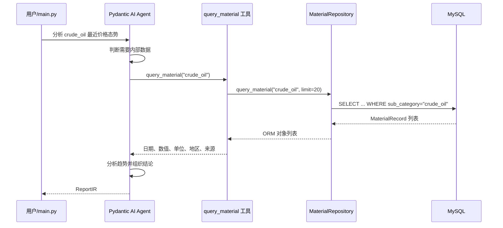

# MySQL 物资态势分析 Agent：从零理解当前最小闭环

这是一份面向初学者的项目说明。你不需要预先了解 Agent、ORM、依赖注入或工具调用；本文会从“这个项目到底在做什么”开始，逐步解释代码如何协作、数据如何流动、目前已经完成什么，以及下一步如何加入 `web_search()`。

---

## 1. 先用一句话理解项目

当前项目允许大语言模型接收一个物资分析问题，在需要数据时主动调用 Python 工具，从 MySQL 的 `material_records` 表查询内部数据，最后按照固定的 `ReportIR` 格式生成一份结构化简报。

例如，当前 `main.py` 提出的问题是：

> 分析 `crude_oil` 最近价格态势，生成简报。

理想情况下，Agent 会完成下面这条链路：

```text
用户问题
  → DeepSeek Agent 理解任务
  → Agent 调用 query_material 工具
  → Repository 查询 MySQL
  → 数据返回给 Agent
  → Agent 分析数据
  → 输出固定结构的 ReportIR
```

这就是当前项目的“最小闭环”。

所谓闭环，是指问题不是只进入模型就结束，而是能够：

1. 接收问题；
2. 判断需要什么数据；
3. 通过工具取得真实数据；
4. 根据真实数据完成分析；
5. 输出程序可以继续使用的结构化结果。

---

## 2. 当前进度总览

### 已经完成

- Python 项目和虚拟环境已经建立。
- 已连接本机 MySQL 数据库。
- 已定义 `material_records` 对应的 SQLModel ORM 模型。
- 已把 `data.json` 的 20 条元数据导入数据库。
- 已实现幂等导入器：重复运行不会制造重复记录。
- 已实现 Repository 数据访问层。
- 已实现 Agent 内部工具 `query_material()`。
- 已通过依赖注入把 Repository 提供给 Agent 工具。
- 已定义结构化输出模型 `ReportIR`。
- 已配置 DeepSeek 模型名称和 `.env` 加载逻辑。
- 已验证内部数据库查询链路。

当前数据库中共有 20 条记录：

| `sub_category` | 数量 | 含义 |
|---|---:|---|
| `crude_oil` | 7 | WTI 原油价格 |
| `surface_weather` | 7 | 上海地表天气/温度 |
| `food_price_index` | 6 | FAO 食品价格指数 |

### 尚未完成

- 尚未实现真正的 `web_search()` Python 工具。
- 尚未把外部搜索客户端加入 `AppDeps`。
- 尚未定义外部搜索结果的统一数据结构。
- 尚未实现来源去重、可信度筛选、引用和超时重试。
- 尚未提供 Web API 或前端界面。
- 尚未建立正式的自动化测试套件。
- 尚未使用数据库迁移工具管理表结构。

特别注意：`agent.py` 的提示词虽然写了“必要时搜索外部信息”，但提示词只是给模型的工作说明。代码里目前没有注册 `web_search()`，所以 Agent 现在无法真正执行外部搜索。

---

## 3. 项目结构

```text
poc3-1/
├─ .env                         # 本机私密配置，不应提交到 Git
├─ .env.example                 # 配置模板，绝对不能放真实密钥
├─ pyproject.toml               # Python 版本和直接依赖
├─ uv.lock                      # 精确锁定所有依赖版本
└─ mysql_demo/
   ├─ README.md                 # 你正在阅读的文档
   ├─ main.py                   # 应用主入口
   ├─ config.py                 # 加载和校验 DeepSeek 配置
   ├─ agent.py                  # 定义 Agent、模型、提示词和输出类型
   ├─ tools.py                  # 注册 Agent 可以调用的工具
   ├─ deps.py                   # 定义注入给 Agent 的依赖
   ├─ repository.py             # 封装数据库查询
   ├─ database.py               # 创建数据库 Engine 和 Session
   ├─ models.py                 # material_records 的 ORM 模型
   ├─ report.py                 # Agent 的结构化输出模型
   ├─ data.json                 # 20 条原始元数据
   ├─ import_data.py            # 校验并幂等导入 data.json
   └─ test_mysql.py             # 最简单的数据库查询检查
```

你可以先把这些文件分成四层：

| 层 | 文件 | 负责什么 |
|---|---|---|
| 应用编排层 | `main.py` | 把所有组件组装起来并启动一次任务 |
| Agent 层 | `agent.py`、`tools.py`、`deps.py`、`report.py` | 模型推理、工具调用、依赖和输出约束 |
| 数据访问层 | `repository.py`、`database.py`、`models.py` | 连接 MySQL、生成 SQL、返回数据 |
| 数据准备层 | `data.json`、`import_data.py` | 校验并把源数据写入数据库 |

---

## 4. 最小闭环是如何实现的

下面用一次真实调用解释所有组件如何协作。


### 第 1 步：`main.py` 启动

`main.py` 是当前应用入口。它主要做四件事：

1. 检查 `DEEPSEEK_API_KEY`；
2. 创建数据库 Session；
3. 创建 Repository 和 `AppDeps`；
4. 调用 `agent.run_sync()`。

这里没有把数据库查询代码直接写在 `main.py` 中，因为我们希望每一层只承担一种职责。

### 第 2 步：建立数据库 Session

`database.py` 使用 SQLModel 创建：

- `engine`：数据库连接引擎；
- `Session`：一次数据库工作会话。

可以把 Engine 理解成“数据库连接工厂”，把 Session 理解成“一次操作数据库的工作台”。

`main.py` 使用：

```python
with get_session() as session:
    ...
```

这样离开 `with` 代码块时，Session 会被关闭，连接可以被连接池回收。

### 第 3 步：创建 Repository

`MaterialRepository` 接收 Session：

```python
repo = MaterialRepository(session)
```

Repository 的作用是隐藏 SQL 查询细节。业务层只需要说：

```python
repo.query_material("crude_oil")
```

而不需要到处重复：

```python
select(MaterialRecord).where(...).order_by(...).limit(...)
```

当前查询逻辑是：

1. 根据 `sub_category` 精确匹配；
2. 按 `period` 从新到旧排序；
3. 默认最多返回 20 条。

### 第 4 步：把 Repository 放入 `AppDeps`

`deps.py` 中定义：

```python
@dataclass
class AppDeps:
    material_repo: MaterialRepository
```

然后 `main.py` 创建：

```python
deps = AppDeps(material_repo=repo)
```

这叫“依赖注入”。

简单理解：工具需要 Repository，但工具不自己创建 Repository，而是由 `main.py` 提前准备好，再传进去。

这样做有三个好处：

- 工具不需要知道数据库密码和连接方式；
- 测试时可以传入假的 Repository；
- 以后增加 `web_search_client` 时，可以继续放到 `AppDeps`。

### 第 5 步：Agent 接收问题

`agent.py` 定义了一个 Pydantic AI `Agent`，它包含：

- 使用哪个模型：`DEEPSEEK_MODEL`；
- 工具运行时需要什么依赖：`AppDeps`；
- 最终必须输出什么结构：`ReportIR`；
- 系统工作说明：先查询数据库、分析变化、必要时搜索、禁止编造。

`defer_model_check=True` 表示模块导入时先不立即创建外部模型连接。这样即使本机还没配置 Key，其他不依赖模型的模块也能正常导入和测试。

### 第 6 步：模型决定调用工具

`tools.py` 使用 `@agent.tool` 注册 `query_material()`。

模型看到工具名称、参数和文档后，可以生成类似下面的工具调用：

```text
query_material(sub_category="crude_oil")
```

注意：大模型不能直接执行 Python，也不能直接访问 MySQL。它只能提出“我要调用这个工具”。Pydantic AI 收到工具调用请求后，才会真正执行对应的 Python 函数。

### 第 7 步：工具取得依赖并查询数据库

工具函数接收：

```python
ctx: RunContext[AppDeps]
```

通过下面这行拿到 `main.py` 注入的 Repository：

```python
repo = ctx.deps.material_repo
```

然后调用：

```python
records = repo.query_material(sub_category)
```

### 第 8 步：把 ORM 对象转换成模型容易理解的数据

Repository 返回的是 `MaterialRecord` ORM 对象。工具不会把整个对象直接交给模型，而是选择必要字段：

```python
{
    "period": str(r.period),
    "value": r.value,
    "unit": r.unit,
    "region": r.region,
    "source": r.source,
}
```

这一步很重要，因为：

- 减少发送给模型的 Token；
- 避免暴露无关字段；
- 让模型收到的结构更稳定；
- 后续可以在工具层统一处理空值和格式。

### 第 9 步：输出 `ReportIR`

`report.py` 使用 Pydantic 定义最终结果：

```python
class ReportIR(BaseModel):
    title: str
    summary: str
    key_findings: list[str]
    risks: list[str]
    suggestions: list[str]
```

这意味着最终输出不能只是任意自然语言，而必须包含：

- 标题；
- 摘要；
- 关键发现；
- 风险；
- 建议。

这叫“结构化输出”。它比普通文本更适合：

- 保存到数据库；
- 返回给 API；
- 渲染到网页；
- 生成 PDF；
- 被另一个程序继续处理。

---

## 5. 每个文件的职责

### `main.py`：总装配入口

它负责连接所有组件，但不负责实现数据库查询和分析逻辑。

你可以把它理解成导演：

- Session 是数据库工作环境；
- Repository 是数据管理员；
- `AppDeps` 是工具箱；
- Agent 是分析员；
- `ReportIR` 是最终报告模板。

运行方式：

```powershell
E:\code\poc3-1\.venv\Scripts\python.exe E:\code\poc3-1\mysql_demo\main.py
```

### `config.py`：配置加载与检查

它从项目根目录读取 `.env`，并提供：

- `DEEPSEEK_MODEL`；
- `require_deepseek_api_key()`；
- `ConfigurationError`。

当前默认模型名为：

```text
deepseek:deepseek-v4-pro
```

真实 API Key 不应该出现在 Python 源码里，也不应该放在 `.env.example` 中。

### `agent.py`：定义 Agent

这里定义：

- 模型；
- 依赖类型；
- 输出类型；
- Agent 工作说明；
- 工具注册。

`agent.py` 不创建 Session，也不直接查询数据库。这些外部资源由运行入口注入。

### `tools.py`：Agent 的可执行能力

当前只有一个工具：

```text
query_material(sub_category: str)
```

支持的分类：

- `crude_oil`
- `food_price_index`
- `surface_weather`

工具是“模型世界”和“真实程序世界”之间的桥梁。

提示词只能告诉模型应该做什么，工具才能让模型真正做到。

### `deps.py`：依赖容器

当前只包含：

```text
material_repo
```

未来加入 Web Search 后，这里可能变为：

```python
@dataclass
class AppDeps:
    material_repo: MaterialRepository
    web_search_client: WebSearchClient
```

上面只是未来设计示意，当前代码中还没有 `WebSearchClient`。

### `repository.py`：数据访问层

它负责构造 SQLModel 查询并返回 `MaterialRecord`。

为什么不让工具直接写 SQL？

- 查询规则集中管理；
- 以后更换数据库实现时影响更小；
- 更容易测试；
- 防止 Agent 工具和数据库细节绑死。

### `database.py`：连接数据库

当前使用的连接协议是：

```text
mysql+pymysql
```

含义是：

- 数据库是 MySQL；
- SQLAlchemy/SQLModel 使用 PyMySQL 作为底层驱动。

连接 URL 的通用格式是：

```text
mysql+pymysql://用户名:密码@主机:端口/数据库名
```

当前连接 URL 仍直接写在 `database.py`，适合学习演示，但不适合生产环境。后续应改成：

```dotenv
DATABASE_URL=mysql+pymysql://...
```

再由 `config.py` 读取。

Engine 还配置了：

- `echo=True`：把 SQL 打印到终端，方便学习和排错；
- `pool_pre_ping=True`：使用连接前先确认连接仍有效；
- `pool_recycle=3600`：定期回收旧连接，减少 MySQL 主动断开连接带来的问题。

### `models.py`：ORM 模型

`MaterialRecord` 同时承担两件事：

1. 用 Python 类型描述一条物资记录；
2. 映射 MySQL 的 `material_records` 表。

主要字段：

| 字段 | Python 类型 | 作用 |
|---|---|---|
| `id` | `int \| None` | 数据库自增主键 |
| `record_id` | `str` | 源记录唯一 ID，防止重复 |
| `category` | `str \| None` | 大类，如 energy |
| `sub_category` | `str \| None` | 子类，也是当前主要查询条件 |
| `region` | `str \| None` | 地区 |
| `metric_type` | `str \| None` | 指标类型 |
| `value` | `float \| None` | 指标数值 |
| `unit` | `str \| None` | 单位 |
| `period` | `datetime \| None` | 数据所属时间 |
| `source` | `str \| None` | 数据来源 |
| `source_url` | `str \| None` | 来源地址 |
| `confidence` | `str \| None` | 可信度标签 |
| `geo_scale` | `str \| None` | 地理粒度 |
| `mom_change` | `float \| None` | 环比变化 |
| `yoy_change` | `float \| None` | 同比变化 |
| `fetched_at` | `datetime \| None` | 抓取时间 |
| `raw_metadata` | `dict \| None` | 来源特有的扩展元数据 |
| `geo_ref` | `dict \| None` | 地理定位扩展信息 |

`raw_metadata` 和 `geo_ref` 使用 MySQL JSON 类型，可以保存不同来源不完全一致的扩展字段。

### `report.py`：最终报告协议

`ReportIR` 中的 `IR` 可以理解为 Intermediate Representation，即“中间标准表示”。

无论模型内部如何推理，输出都被统一为一个固定协议。以后 Web API、页面或文件生成模块只需要认识 `ReportIR`，不需要理解模型的自由文本。

### `data.json`：源元数据

当前包含 20 条数据。源 JSON 使用 `id`，数据库模型使用 `record_id`。

导入器会完成映射：

```text
data.json.id → material_records.record_id
```

源数据中的 `schema_version` 没有单独数据库列，因此被保存在：

```text
raw_metadata.schema_version
```

### `import_data.py`：幂等导入器

导入器会：

1. 读取 UTF-8 JSON；
2. 检查顶层必须是数组；
3. 检查必填字段；
4. 检查 ID 是否为空或重复；
5. 解析 ISO 日期；
6. 把带时区时间统一转为 UTC；
7. 使用 ORM 做最终类型校验；
8. 根据 `record_id` 查询已有记录；
9. 新记录插入，变化记录更新，无变化记录跳过；
10. 使用一个事务提交整批数据。

“幂等”表示同一份数据重复执行多次，最终数据库状态不会不断变化。

当前第二次导入的结果是：

```text
新增 0，更新 0，未变化 20
```

### `test_mysql.py`：最简单的数据库冒烟检查

它直接查询整张表并打印：

- `sub_category`
- `value`

它适合快速确认数据库是否可连接、表是否有数据，但还不是正式的自动化测试。

---

## 6. 当前使用的技术和必须理解的知识

### Python 3.14

项目要求 Python `>=3.14`。Python 负责：

- 读取配置和 JSON；
- 定义 Agent；
- 执行工具；
- 查询数据库；
- 校验输入输出。

### uv

`uv` 是 Python 项目和依赖管理工具。

这里有两个关键文件：

- `pyproject.toml`：声明项目直接需要什么；
- `uv.lock`：锁定所有直接和间接依赖的精确版本。

同步环境：

```powershell
cd E:\code\poc3-1
uv sync
```

### MySQL

MySQL 是内部结构化数据的持久化存储。

当前项目假设以下资源已经存在：

- MySQL 服务；
- `material_intelligence` 数据库；
- `material_records` 表。

当前 Python 代码不会自动创建数据库和表。

### PyMySQL

PyMySQL 是 Python 和 MySQL 之间的底层驱动。

SQLModel 不会自己通过网络连接 MySQL，而是借助 SQLAlchemy，再由 SQLAlchemy 使用 PyMySQL。

### SQLAlchemy

SQLAlchemy 提供：

- Engine；
- 连接池；
- Session；
- SQL 表达式；
- ORM 基础能力；
- 事务。

### SQLModel

SQLModel 建立在 SQLAlchemy 和 Pydantic 之上。

它让同一个 Python 类既可以表达数据类型，又可以映射数据库表。

例如：

```python
select(MaterialRecord).where(
    MaterialRecord.sub_category == "crude_oil"
)
```

SQLModel/SQLAlchemy 会把它转换成 SQL。

### ORM

ORM 是 Object-Relational Mapping，即“对象关系映射”。

数据库中的一行会变成一个 Python 对象：

```python
record.value
record.period
record.source
```

你不需要自己把每个 SQL 结果元组转换成字典。

### Session 和事务

Session 代表一次数据库操作上下文。

事务保证一批写入要么全部成功，要么全部回滚。`import_data.py` 在导入过程中只在最后 `commit()`；中间任何错误都会 `rollback()`。

### Pydantic

Pydantic 根据 Python 类型进行数据校验和转换。

当前主要用于：

- 校验 `MaterialRecord` 导入字段；
- 约束 Agent 最终输出为 `ReportIR`。

### Pydantic AI

Pydantic AI 是 Agent 编排框架。它负责：

- 调用模型；
- 把工具定义提供给模型；
- 接收模型发出的工具调用；
- 执行 Python 工具；
- 把工具结果送回模型；
- 校验最终结构化输出；
- 管理运行上下文和依赖。

### Tool Calling

Tool Calling 的本质不是模型自己执行函数，而是一个协议：

1. 模型输出“希望调用哪个工具、参数是什么”；
2. 框架验证参数；
3. Python 执行工具；
4. 框架把结果发回模型；
5. 模型继续推理或输出答案。

### 依赖注入

依赖注入的核心思想是：

> 一个组件需要资源时，不要在组件内部偷偷创建，而由外部明确传入。

当前注入的是 `MaterialRepository`。未来还可以注入：

- Web Search 客户端；
- 日志器；
- 缓存；
- 用户身份；
- 请求追踪 ID。

### Structured Output

结构化输出表示模型必须按程序定义的 Schema 返回结果。

优势：

- 字段稳定；
- 自动校验；
- 更容易保存和展示；
- 下游不用解析自然语言。

---

## 7. 从零运行项目
### 创建数据库和表
-- 1. 创建数据库（如果不存在）
```sql
CREATE DATABASE IF NOT EXISTS `material_intelligence`
    CHARACTER SET utf8mb4
    COLLATE utf8mb4_unicode_ci;
```
-- 2. 使用该数据库
```sql
USE `material_intelligence`;
```

以下命令均以 Windows PowerShell 为例。

### 第 1 步：进入项目

```powershell
cd E:\code\poc3-1
```

### 第 2 步：同步依赖

```powershell
uv sync
```

如果环境已经同步，可以跳过。

为了避免 PowerShell 激活脚本执行策略问题，后面的示例直接使用虚拟环境解释器，不要求执行 `Activate.ps1`。

### 第 3 步：确认 MySQL

确认：

- MySQL 服务已启动；
- 数据库连接信息正确；
- `material_intelligence.material_records` 已存在。

可以在 MySQL 客户端执行：

```sql
USE material_intelligence;
SELECT COUNT(*) FROM material_records;
SELECT sub_category, COUNT(*)
FROM material_records
GROUP BY sub_category;
```

当前预期总数是 20。

### 第 4 步：配置 DeepSeek

项目根目录应该有 `.env`：

```dotenv
DEEPSEEK_API_KEY=你的真实密钥
DEEPSEEK_MODEL=deepseek:deepseek-v4-pro
```

安全规则：

- `.env` 只保存在本机；
- `.env` 已加入 `.gitignore`；
- `.env.example` 中只能保留空值或占位符；
- 不要把 Key 发到聊天、截图、日志或 GitHub；
- 如果 Key 曾出现在 `.env.example` 或 Git 历史中，应立即在平台撤销并生成新 Key。

### 第 5 步：预检数据导入

```powershell
E:\code\poc3-1\.venv\Scripts\python.exe `
  E:\code\poc3-1\mysql_demo\import_data.py `
  --dry-run
```

`--dry-run` 只校验和统计，不写数据库。

当前数据已导入，因此预期类似：

```text
预检完成：总计 20，新增 0，更新 0，未变化 20
```

### 第 6 步：正式导入或同步

```powershell
E:\code\poc3-1\.venv\Scripts\python.exe `
  E:\code\poc3-1\mysql_demo\import_data.py
```

如果修改了 `data.json`：

- 新 ID 会插入；
- 已有 ID 且字段变化会更新；
- 完全相同会跳过。

### 第 7 步：只检查 MySQL 查询

```powershell
E:\code\poc3-1\.venv\Scripts\python.exe `
  E:\code\poc3-1\mysql_demo\test_mysql.py
```

看到分类和数值，说明：

- Python 能连接 MySQL；
- 数据库和表存在；
- ORM 查询可以执行；
- 表中已有数据。

这个步骤不需要 DeepSeek API。

### 第 8 步：运行完整 Agent

```powershell
E:\code\poc3-1\.venv\Scripts\python.exe `
  E:\code\poc3-1\mysql_demo\main.py
```

这一步需要：

- MySQL 正常；
- 数据已经导入；
- `.env` 中有有效 Key；
- 当前模型账号可用；
- 网络能够访问模型服务。

---

## 8. 如何判断是哪一层出了问题

建议从底层到上层逐层排查。

```text
第 1 层：Python 是否能启动
第 2 层：依赖是否安装
第 3 层：MySQL 是否连接
第 4 层：表中是否有数据
第 5 层：Repository 是否返回记录
第 6 层：Agent 工具是否能调用
第 7 层：外部模型是否可用
第 8 层：ReportIR 是否校验通过
```

### 快速检查 Python 语法

```powershell
E:\code\poc3-1\.venv\Scripts\python.exe `
  -m compileall -q E:\code\poc3-1\mysql_demo
```

### 快速检查导入数据

```powershell
E:\code\poc3-1\.venv\Scripts\python.exe `
  E:\code\poc3-1\mysql_demo\import_data.py `
  --dry-run
```

### 快速检查数据库

```powershell
E:\code\poc3-1\.venv\Scripts\python.exe `
  E:\code\poc3-1\mysql_demo\test_mysql.py
```

### 最后才检查 Agent

```powershell
E:\code\poc3-1\.venv\Scripts\python.exe `
  E:\code\poc3-1\mysql_demo\main.py
```

这样排查的好处是：如果数据库测试已经失败，就不用先怀疑大模型。

