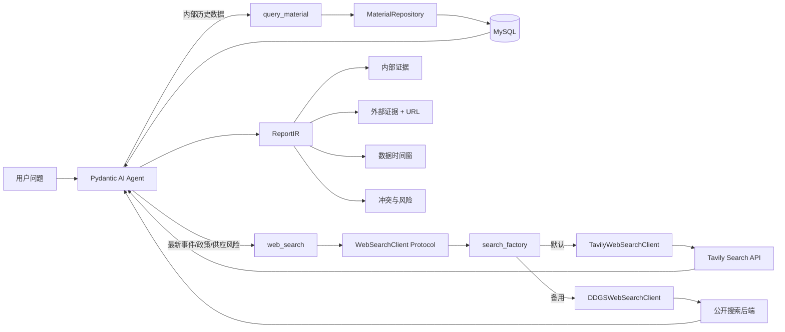
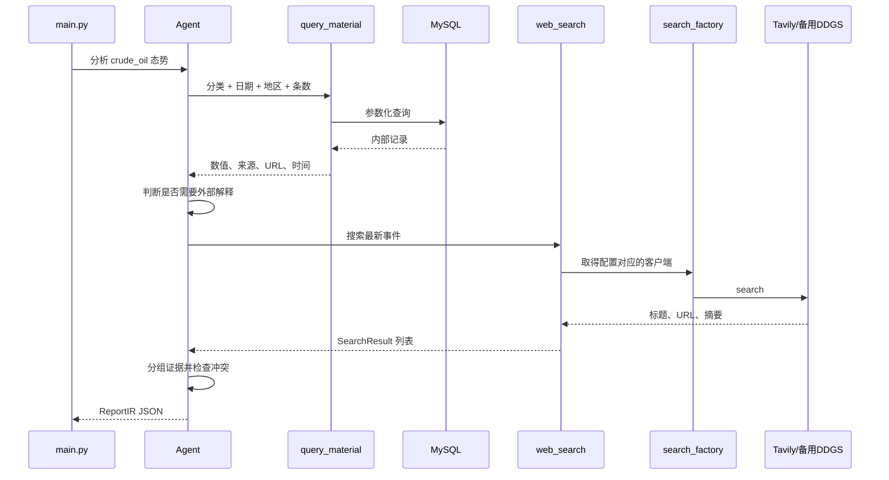

# mysql_demo2：内部数据库 + Web Search + 可追溯报告

`mysql_demo2` 是在 `mysql_demo` 最小闭环基础上完成的第二版。

它已经实现三个阶段：

1. 巩固内部数据库闭环；
2. 加入最小 Web Search；
3. 增强报告证据和可信度。

当前完整能力是：

```text
用户问题
  → Pydantic AI Agent
  → 查询内部 MySQL 历史数据
  → 必要时搜索外部公开网页
  → 区分内部证据和外部证据
  → 标明数据时间与来源 URL
  → 识别内部/外部信息冲突
  → 输出结构化 ReportIR
```

本文按“先理解，再运行，再测试”的顺序介绍项目。

如果你是零基础读者，想按技术主题系统学习 Python、数据库、Agent、Web Search、Pydantic 和测试，请从 [`docs/README.md`](docs/README.md) 开始。`docs` 中提供了 7 天学习路线、分主题教程、动手练习和掌握清单。

---

## 1. 三个阶段完成情况

### 阶段 1：巩固内部闭环

已完成：

- 数据库 URL 已从 Python 源码移入根目录 `.env`；
- `query_material` 支持分类、开始日期、结束日期、地区和条数；
- 分类使用 `Literal`，模型只能选择三个合法类别；
- Repository 使用 SQLite 完成独立单元测试；
- Agent 工具使用 Pydantic AI `TestModel` 完成离线测试；
- 使用标准库 `logging` 统一日志；
- SQLAlchemy SQL 噪音默认关闭；
- 真实 MySQL 参数组合查询验证通过。

### 阶段 2：最小 Web Search

已完成：

- 定义 `SearchResult`；
- 定义 `WebSearchClient` Protocol；
- 实现默认的 `TavilyWebSearchClient`；
- 保留 `DDGSWebSearchClient` 作为无 Tavily Key 时的备用实现；
- 使用 `WEB_SEARCH_PROVIDER` 在两个供应商之间切换；
- Web Search 通过 `AppDeps` 注入；
- 注册 `web_search` Agent 工具；
- 使用 `FakeWebSearchClient` 完成离线测试；
- 使用 pytest monkeypatch 和 Stub 分别验证 Tavily、DDGS 的结果标准化、URL 去重和异常包装；
- 完成一次真实 Tavily API 搜索，成功返回 3 条公开网页结果。

### 阶段 3：增强报告可信度

已完成：

- 报告包含数据时间窗；
- 报告包含内部和外部证据；
- 内部、外部证据分组保存；
- 外部证据强制要求 URL；
- 证据可以保存数据时间和检索时间；
- 报告包含结构化冲突项；
- Agent 被要求把冲突同时写入 `conflicts` 和 `risks`；
- 报告可信度模型测试通过。

---

## 2. 当前架构



架构被分成五层：

| 层 | 文件 | 职责 |
|---|---|---|
| 应用编排 | `main.py` | 创建依赖、启动 Agent、保存并输出报告 |
| 模型适配 | `llm_factory.py` | 解析 provider profile，创建并注入 LLM |
| Agent | `agent.py`、`tools.py`、`deps.py` | 推理、工具注册、依赖注入 |
| 内部数据 | `repository.py`、`database.py`、`models.py` | 查询 MySQL |
| 外部搜索 | `search_models.py`、`search_factory.py`、`tavily_search.py`、`web_search.py` | 搜索协议、供应商选择、Tavily 默认适配器、DDGS 备用适配器 |
| 输出可信度 | `report.py` | 时间、证据、URL、冲突和报告结构 |

---

## 3. 文件结构

```text
poc3-1/
├─ .env                         # 真实私密配置，不提交
├─ .env.example                 # 空白配置模板
├─ pyproject.toml               # 直接依赖
├─ uv.lock                      # 精确依赖版本
└─ mysql_demo2/
   ├─ __init__.py              # Python 包标识
   ├─ README.md
   ├─ docs/                    # 分主题技术学习手册
   ├─ main.py                   # 完整应用入口
   ├─ agent.py                  # Agent 和可信度规则
   ├─ tools.py                  # 内部查询、外部搜索工具
   ├─ deps.py                   # Repository + WebSearchClient
   ├─ domain.py                 # 分类和时间范围 Literal
   ├─ config.py                 # 数据库、搜索等环境配置
   ├─ llm_factory.py            # 通用 LLM profile 解析与模型工厂
   ├─ logging_config.py         # 日志规范
   ├─ database.py               # MySQL Engine/Session
   ├─ models.py                 # MaterialRecord ORM
   ├─ repository.py             # 参数化内部查询
   ├─ search_models.py          # SearchResult 和 Protocol
   ├─ search_factory.py         # 按配置选择 Tavily 或 DDGS
   ├─ tavily_search.py          # Tavily Search API 适配器
   ├─ web_search.py             # DDGS 备用适配器
   ├─ report.py                 # 可追溯 ReportIR
   ├─ verify_llm_api.py         # 不读取业务数据的双协议真实 smoke
   ├─ verify_web_search.py      # 独立真实网络验收
   ├─ data.json
   ├─ import_data.py
   ├─ test_mysql.py
   └─ tests/
      ├─ test_repository.py
      ├─ test_search_factory.py
      ├─ test_tavily_search.py
      ├─ test_web_search.py
      ├─ test_agent_tools.py
      ├─ test_llm_factory.py
      └─ test_report.py
```

---

## 4. 环境配置

项目读取根目录：

```text
E:\code\poc3-1\.env
```

示例：

```dotenv
# 选择当前 LLM。已配置各 profile 后，通常只改这一行。
LLM_PROVIDER=deepseek
LLM_API_STYLE=openai

# 通用临时覆盖项：留空时读取当前 provider 的专属配置
LLM_API_KEY=
LLM_MODEL=
LLM_BASE_URL=

# DeepSeek profile
DEEPSEEK_API_KEY=你的真实密钥
DEEPSEEK_MODEL=deepseek-v4-pro
DEEPSEEK_BASE_URL=https://api.deepseek.com

# MiMo 同时支持 OpenAI 与 Anthropic 两种协议
MIMO_API_KEY=
MIMO_MODEL=mimo-v2.5-pro
MIMO_OPENAI_BASE_URL=https://api.xiaomimimo.com/v1
MIMO_ANTHROPIC_BASE_URL=https://api.xiaomimimo.com/anthropic

# Anthropic 官方 API
ANTHROPIC_API_KEY=
ANTHROPIC_MODEL=
ANTHROPIC_BASE_URL=https://api.anthropic.com

# 阿里云百炼 profile（北京地域公共地址）
BAILIAN_API_KEY=
BAILIAN_MODEL=qwen-plus
BAILIAN_BASE_URL=https://dashscope.aliyuncs.com/compatible-mode/v1

DATABASE_URL=mysql+pymysql://用户名:密码@localhost:3306/material_intelligence
LOG_LEVEL=INFO

WEB_SEARCH_PROVIDER=tavily
TAVILY_API_KEY=你的真实Tavily密钥
TAVILY_SEARCH_DEPTH=basic
TAVILY_SEARCH_TOPIC=general
WEB_SEARCH_TIMEOUT=30
TAVILY_MAX_RETRIES=1
TAVILY_RETRY_DELAY=1

# 以下三项只在 WEB_SEARCH_PROVIDER=ddgs 时使用
WEB_SEARCH_REGION=wt-wt
WEB_SEARCH_SAFESEARCH=moderate
WEB_SEARCH_BACKEND=auto
```

配置含义：

| 配置 | 作用 |
|---|---|
| `LLM_PROVIDER` | 当前模型供应商/profile 名，例如 `deepseek`、`mimo`、`bailian` |
| `LLM_API_STYLE` | API 协议：`openai` 或 `anthropic` |
| `LLM_API_KEY` | 可选通用 Key；非空时覆盖当前 provider 的专属 Key |
| `LLM_MODEL` | 可选通用模型 ID；非空时覆盖当前 provider 的专属模型 |
| `LLM_BASE_URL` | 可选通用兼容地址；非空时覆盖当前 provider 的专属地址 |
| `<PROVIDER>_API_KEY` | 某个 provider 自己的密钥，如 `MIMO_API_KEY` |
| `<PROVIDER>_MODEL` | 供应商控制台显示的原始模型 ID，不带 `deepseek:` 等前缀 |
| `<PROVIDER>_<STYLE>_BASE_URL` | 某供应商某协议的地址，如 `MIMO_ANTHROPIC_BASE_URL` |
| `<PROVIDER>_BASE_URL` | 两种协议共用时的后备地址 |
| `DATABASE_URL` | MySQL 连接 URL |
| `LOG_LEVEL` | 日志级别 |
| `WEB_SEARCH_PROVIDER` | `tavily`（默认）或 `ddgs` |
| `TAVILY_API_KEY` | Tavily API 鉴权密钥，只在 Tavily 模式需要 |
| `TAVILY_SEARCH_DEPTH` | 搜索深度，默认 `basic` |
| `TAVILY_SEARCH_TOPIC` | 搜索主题：`general`、`news` 或 `finance` |
| `WEB_SEARCH_TIMEOUT` | Tavily 或 DDGS 单次搜索超时秒数 |
| `TAVILY_MAX_RETRIES` | 临时故障后的重试次数，默认 1（总计最多 2 次请求） |
| `TAVILY_RETRY_DELAY` | 重试前等待秒数，默认 1 |
| `WEB_SEARCH_REGION` | DDGS 备用模式的搜索地区 |
| `WEB_SEARCH_SAFESEARCH` | DDGS 备用模式的安全搜索 |
| `WEB_SEARCH_BACKEND` | DDGS 备用模式的搜索后端 |

### 4.1 LLM 配置优先级

`llm_factory.py` 按以下顺序寻找每个值：

1. 通用覆盖项 `LLM_API_KEY / LLM_MODEL / LLM_BASE_URL`；
2. 协议专属项 `<PROVIDER>_<STYLE>_API_KEY / _MODEL / _BASE_URL`；
3. 当前 profile 的 `<PROVIDER>_API_KEY / _MODEL / _BASE_URL`；
4. 已知 provider + style 的默认 Base URL。

例如 `LLM_PROVIDER=mimo`、`LLM_API_STYLE=anthropic` 会优先读取
`MIMO_ANTHROPIC_*`，缺项再回退到共同的 `MIMO_*`。因此 MiMo 的 Key 和模型
可以共用，但 OpenAI/Anthropic Base URL 分开保存。

### 4.2 切换供应商

在相应 profile 的三个值已经填好后，切换时只需修改：

```dotenv
# DeepSeek
LLM_PROVIDER=deepseek
LLM_API_STYLE=openai

# 或百炼
LLM_PROVIDER=bailian
LLM_API_STYLE=openai

# 或 MiMo OpenAI-compatible
LLM_PROVIDER=mimo
LLM_API_STYLE=openai

# 或 MiMo Anthropic-compatible
LLM_PROVIDER=mimo
LLM_API_STYLE=anthropic
```

实际 `.env` 中只能各有一个生效的 `LLM_PROVIDER` 和 `LLM_API_STYLE`。
MiMo 按量付费的两种官方地址已写入模板；Token Plan 必须改成控制台显示的
两套专属地址和专属 Key。百炼 Key 与 Base URL 必须属于同一地域。

`LLM_PROVIDER` 只控制大模型；`WEB_SEARCH_PROVIDER` 控制 Tavily/DDGS。
两者互相独立，更换大模型不会自动更换搜索服务。

安全规则：

- `.env` 不提交 Git；
- `.env.example` 只能放空值或占位符；
- 日志不得打印数据库 URL、密码或 API Key；
- 如果 Key 曾进入 Git、聊天或截图，应立即在供应商控制台撤销并生成新 Key；
- 生产环境建议使用专用低权限数据库用户。

---

## 5. 阶段 1：内部查询增强

### 5.1 分类类型

`domain.py` 定义：

```python
MaterialCategory = Literal[
    "crude_oil",
    "food_price_index",
    "surface_weather",
]
```

使用 `Literal` 后：

- Agent 的工具 Schema 会列出合法值；
- IDE 和类型检查器能发现错误；
- 工具不能随意接收 `oil`、`wti` 等未定义名称。

### 5.2 Repository 查询参数

当前接口：

```python
query_material(
    sub_category,
    *,
    start_date=None,
    end_date=None,
    region=None,
    limit=20,
)
```

参数：

| 参数 | 含义 |
|---|---|
| `sub_category` | 三个合法分类之一 |
| `start_date` | 包含该日期 |
| `end_date` | 包含该日期 |
| `region` | 精确地区过滤 |
| `limit` | 1～100 条 |

查询仍按 `period` 从新到旧排序。

示例：

```python
records = repository.query_material(
    "crude_oil",
    start_date=date(2026, 7, 1),
    end_date=date(2026, 7, 31),
    region="US-OK-CUSHING",
    limit=2,
)
```

真实 MySQL 验证返回了 2026 年 7 月最新两条原油记录。

### 5.3 数据库 URL

`database.py` 不再出现用户名、密码或数据库地址。

Engine 通过：

```python
require_database_url()
```

从 `.env` 取得连接。

Engine 使用 `lru_cache`，一个进程只创建一次；Session 由
`SessionPerQueryMaterialRepository` 在每次 `query_material` 调用所在的工作线程中
单独创建和关闭。Pydantic AI 可能并行执行工具，因此不能把一个 Session 放进
`AppDeps` 后供所有工具共享。

### 5.4 日志

日志格式：

```text
时间 级别 模块 消息
```

工具会记录：

- 查询分类；
- 日期和地区参数；
- 请求条数；
- 返回条数；
- 搜索词和搜索结果数；
- 搜索失败类型。

日志不会记录：

- 任意 LLM/API provider 的 Key；
- 数据库密码；
- 完整数据库 URL。

---

## 6. 阶段 2：Web Search

### 6.1 为什么需要 Protocol

`WebSearchClient` 是一个协议：

```python
class WebSearchClient(Protocol):
    def search(...) -> list[SearchResult]:
        ...
```

Agent 工具依赖的是这个协议，而不是直接依赖 DDGS。

因此可以替换为：

- `DDGSWebSearchClient`
- `FakeWebSearchClient`
- Tavily 适配器
- Brave Search 适配器
- 公司内部搜索服务

只要新实现提供同样的 `search()` 方法，工具层不需要修改。

### 6.2 SearchResult

每条搜索结果统一为：

```python
class SearchResult(BaseModel):
    title: str
    url: str
    snippet: str
    source: str | None
    score: float | None
    published_at: datetime | None
    retrieved_at: datetime
```

为什么同时有两个时间？

- `published_at`：网页内容发布时间，搜索后端不一定提供；
- `retrieved_at`：本程序取得该搜索结果的时间，始终可记录。

`score` 是供应商给出的相关性分数；Tavily 会返回该值，DDGS 可能没有，因此它是可选字段。相关性高不代表信息一定真实，报告仍需保留 URL 并判断来源可信度。

### 6.3 搜索客户端工厂

`search_factory.py` 是供应商选择入口：

```python
client = create_web_search_client()
```

它读取：

```dotenv
WEB_SEARCH_PROVIDER=tavily
```

选择规则：

| 配置值 | 创建的客户端 | 是否需要 Key |
|---|---|---|
| `tavily` | `TavilyWebSearchClient` | 需要 `TAVILY_API_KEY` |
| `ddgs` | `DDGSWebSearchClient` | 不需要 Tavily Key |

`main.py` 和 `verify_web_search.py` 都只调用这个工厂，所以切换供应商时不用修改 Agent、工具或报告代码。

### 6.4 Tavily 默认适配器

项目使用 `tavily-python==0.7.26`。

官方资料：

- [Tavily Python SDK Reference](https://docs.tavily.com/sdk/python/reference)
- [Tavily Search API](https://docs.tavily.com/documentation/api-reference/endpoint/search)
- [tavily-python PyPI](https://pypi.org/project/tavily-python/)

适配器调用同步的 `TavilyClient.search()`，并显式设置：

```text
search_depth=basic
include_answer=false
include_raw_content=false
max_results=工具传入的 1～10
```

这样做的含义：

- `basic` 足以完成当前最小闭环，官方计费是每次 1 credit；
- 不让 Tavily 额外生成答案，因为最终分析由本项目 Agent 完成；
- 不抓取网页全文，只保留与查询最相关的摘要；
- 工具上限仍保持 10 条，即使 Tavily API 本身允许最多 20 条；
- `d/w/m/y` 会原样传给 Tavily 的 `time_range`。

为应对网络波动，Tavily 适配器还会：

- 每次请求最多等待 `WEB_SEARCH_TIMEOUT` 秒，默认 30 秒；
- 只在超时、连接失败或服务端 HTTP 故障时重试；
- 默认重试 1 次，即首次请求加一次重试；
- Key 无效、额度不足、参数错误和权限错误不会重试；
- 重试全部失败时，错误会提示调整超时或切换 DDGS。

Tavily 原始结果的主要字段映射如下：

| Tavily 字段 | SearchResult 字段 |
|---|---|
| `title` | `title` |
| `url` | `url` |
| `content` | `snippet` |
| `score` | `score` |
| `published_date` | `published_at` |
| URL 域名 | `source` |
| 本机当前 UTC 时间 | `retrieved_at` |

`published_date` 主要在 `topic=news` 时返回；没有该字段时保持 `null`，不能凭空推断发布时间。

### 6.5 DDGS 备用适配器

项目继续保留 `ddgs==9.14.4`。

官方资料：

- [DDGS PyPI](https://pypi.org/project/ddgs/)
- [DDGS GitHub](https://github.com/deedy5/ddgs)

DDGS 是元搜索库，可以聚合多个公开搜索后端。它适合：

- Tavily Key 尚未配置时进行开发；
- Tavily 服务临时不可用或额度耗尽时手动切换；
- 对比两个供应商的搜索结果。

切换方法：

```dotenv
WEB_SEARCH_PROVIDER=ddgs
```

适配器负责：

1. 校验搜索词；
2. 限制结果为 1～10；
3. 调用 `DDGS().text()`；
4. 提取 `title`、`href`、`body`；
5. 标准化为 `SearchResult`；
6. 从 URL 提取来源域名；
7. 去除重复 URL；
8. 保存检索时间；
9. 把第三方异常包装成 `WebSearchError`。

### 6.6 为什么 DDGS 使用 auto backend

真实网络环境中单个搜索后端可能：

- 超时；
- 被限流；
- TLS 握手失败；
- 在特定地区不可访问。

`WEB_SEARCH_BACKEND=auto` 让 DDGS 可以尝试其他可用后端。

真实验收中曾观察到一个 Wikipedia 后端 TLS 失败，但其他后端继续工作并返回 3 条结果。这说明适配器不应绑定单一搜索站点。

### 6.7 web_search 工具

Agent 工具参数：

```python
web_search(
    query,
    max_results=5,
    time_limit=None,
)
```

`time_limit` 合法值：

| 值 | 含义 |
|---|---|
| `d` | 最近一天 |
| `w` | 最近一周 |
| `m` | 最近一月 |
| `y` | 最近一年 |

工具从：

```python
ctx.deps.web_search_client
```

取得客户端，因此离线测试可以传 Fake Client。

---

## 7. 阶段 3：可信度模型

### 7.1 ReportIR

当前报告包含：

```text
title
summary
key_findings
risks
suggestions
data_window
evidence
conflicts
```

Agent 将工具重试和最终报告重试分开管理：工具调用保持最多 1 次修正，`ReportIR` 结构校验允许最多 3 次修正。这样能恢复模型偶发漏字段的问题，同时避免数据库查询或 Web Search 被无差别重复执行；重试耗尽仍会抛出 `UnexpectedModelBehavior`。

### 7.2 ReportIR 持久化

`report.py` 中的 `ReportIR` 继续作为纯验证/响应合同；`models.py` 中独立的 `ReportIRRecord` 才是 `report_ir` 数据库表。两者分离，避免把数据库主键、哈希和生成时间泄露到 API。

`main.py` 在 Agent 成功返回后会自动创建 `report_ir` 表（仅该表）并保存报告。同一份已有 JSON 也可以幂等导入：

```powershell
.\.venv\Scripts\python.exe -m poc3.import_report "C:\path\to\report.txt"
```

同一内容使用稳定 SHA-256 识别，重复执行不会新增重复记录。对应查询接口位于 `poc4`：`GET /api/ReportIR` 返回最近一次保存的完整 `ReportIR`。

### 7.3 DataWindow

```python
class DataWindow(BaseModel):
    start: datetime | None
    end: datetime | None
    description: str
```

它解决“结论到底基于哪个时间段”的问题。

模型会校验：

```text
start 不能晚于 end
```

### 7.4 EvidenceItem

每条证据保存：

```text
source_type
title
source_name
summary
url
data_time
retrieved_at
```

`source_type` 只能是：

- `internal`
- `external`

外部证据必须包含 URL，否则 Pydantic 校验失败。

### 7.5 内外部证据分组

```python
class EvidenceGroups(BaseModel):
    internal: list[EvidenceItem]
    external: list[EvidenceItem]
```

模型还会检查：

- `internal` 中不能放 external 证据；
- `external` 中不能放 internal 证据。

这可以避免报告把数据库事实和网页摘要混在一起。

### 7.6 冲突风险

```python
class ConflictItem(BaseModel):
    topic: str
    internal_view: str
    external_view: str
    risk: str
```

例如：

```text
内部数据：近期价格上涨
外部信息：供应压力可能缓解
风险：短期方向仍有不确定性
```

Agent 指令要求：

- 有冲突时填写 `conflicts`；
- 同时在 `risks` 中说明影响；
- 没有冲突时返回空列表；
- 不得为了填字段编造冲突。

---

## 8. 一次完整请求如何运行



关键点：

- Agent 先查内部数据库；
- 外部搜索不是每次必须调用；
- 外部搜索用于补充最新原因和事件；
- 搜索摘要不是等同于已验证事实；
- 报告保留证据和时间，而不只是输出一段文字。

---

## 9. 安装与运行

### 9.1 同步依赖

```powershell
cd E:\code\poc3-1
uv sync --locked
```

### 9.2 检查 Python 语法

```powershell
E:\code\poc3-1\.venv\Scripts\python.exe `
  -m compileall -q E:\code\poc3-1\mysql_demo2
```

### 9.3 检查 MySQL

```powershell
E:\code\poc3-1\.venv\Scripts\python.exe `
  -m mysql_demo2.test_mysql
```

### 9.4 预检数据导入

```powershell
E:\code\poc3-1\.venv\Scripts\python.exe `
  -m mysql_demo2.import_data `
  --dry-run
```

同一份数据已存在时，预期：

```text
总计 20，新增 0，更新 0，未变化 20
```

### 9.5 运行真实 Web Search 验收

```powershell
E:\code\poc3-1\.venv\Scripts\python.exe `
  -m mysql_demo2.verify_web_search `
  "OPEC crude oil supply latest" `
  --max-results 3
```

这一步：

- 会访问真实网络；
- 默认调用 Tavily API；每次 basic 请求消耗 1 credit，发生重试时可能再次计费；
- 不调用 DeepSeek；
- 不产生模型费用；
- 搜索结果会随时间和地区变化。

### 9.6 运行完整 Agent

```powershell
E:\code\poc3-1\.venv\Scripts\python.exe `
  -m mysql_demo2.main
```

这一步需要：

- MySQL 可连接；
- `.env` 中有有效 DATABASE_URL；
- `.env` 中已正确配置当前 `LLM_PROVIDER` 对应的 Key、模型和 Base URL；
- 网络可访问模型和搜索服务。

### 9.4 独立验证 LLM API 协议

下面的 smoke 不读取 MySQL、不注册 Web Search，只向模型发送固定测试文本：

```powershell
# OpenAI-compatible
E:\code\poc3-1\.venv\Scripts\python.exe `
  -m mysql_demo2.verify_llm_api `
  --provider deepseek `
  --api-style openai

# Anthropic-compatible（示例使用 MiMo）
E:\code\poc3-1\.venv\Scripts\python.exe `
  -m mysql_demo2.verify_llm_api `
  --provider mimo `
  --api-style anthropic
```

成功标志：

```text
LLM_PROTOCOL_SMOKE_OK ...
output=PROTOCOL_SMOKE_OK
```

---

## 10. 自动化测试

从项目根目录运行：

```powershell
E:\code\poc3-1\.venv\Scripts\python.exe `
  -m pytest -v
```

测试共 27 个，其中 9 个覆盖双协议配置、模型工厂和安全 smoke，1 个专门验证
四个并发查询各自使用并关闭独立 Session。

`pyproject.toml` 的 `testpaths` 已限定为 `mysql_demo2/tests`，所以 pytest 不会误执行需要真实 MySQL 的 `test_mysql.py`。

### Repository 测试

使用 SQLite 内存数据库，不依赖 MySQL：

- 日期过滤；
- 地区过滤；
- 倒序；
- limit；
- 非法日期范围；
- 非法 limit；
- 并发查询的 Session 隔离与关闭。

### Tavily 适配器测试

使用 pytest monkeypatch 注入 Stub TavilyClient，不访问网络、不消耗 credit：

- 请求参数；
- 时间范围传递；
- `content` 到 `snippet` 的映射；
- 相关性分数；
- 发布时间；
- URL 去重；
- 第三方异常包装；
- 空 Key 校验；
- 超时后重试成功；
- 重试耗尽后的可操作错误提示；
- Key 无效时不重试。

### DDGS 适配器测试

使用 pytest monkeypatch 注入 Stub DDGS，不访问网络：

- 返回值标准化；
- URL 去重；
- 来源域名；
- 检索时间；
- 第三方异常包装。

### 搜索工厂测试

验证：

- `tavily` 创建 Tavily 客户端；
- `ddgs` 创建备用客户端；
- 无效供应商配置会给出明确错误。

### 离线 Agent 工具测试

使用：

- Pydantic AI `TestModel`；
- Fake Repository；
- Fake Web Search Client。

它验证 Agent 能同时调用：

- `query_material`
- `web_search`

整个测试不访问 MySQL、不访问网络、不调用付费模型。

### 报告可信度测试

验证：

- 内部和外部证据分组；
- 数据时间窗；
- 外部证据 URL；
- 冲突风险；
- 缺少外部 URL 时必须失败。

---

## 11. 真实验收结果

本轮完成时：

| 验收 | 结果 |
|---|---|
| Python 编译 | 通过 |
| 自动化测试 | 27/27 通过 |
| OpenAI-compatible 真实 smoke | 通过，DeepSeek 返回 `PROTOCOL_SMOKE_OK` |
| Anthropic-compatible 真实 smoke | 通过，MiMo `mimo-v2.5-pro` 返回 `PROTOCOL_SMOKE_OK` |
| MySQL 日期+地区+条数过滤 | 通过，返回 2 条 |
| Pydantic AI 并发查询真实 MySQL | 通过，4 个工作线程使用并关闭 4 个独立 Session |
| Fake Search 离线 Agent | 通过 |
| 报告可信度约束 | 通过 |
| 真实 Tavily API 搜索 | 通过，返回 3 条 URL |

真实结果内容不是固定测试数据，未来执行时网页标题和排序可能变化。

---

## 12. 日志与排错

### DATABASE_URL 缺失

错误：

```text
未检测到 DATABASE_URL
```

检查项目根目录 `.env`。

### LLM Key、模型或 Base URL 缺失

根据错误中的 provider 名检查 `LLM_*` 通用覆盖项和对应的
`<PROVIDER>_*` profile。该问题只影响完整 Agent，不影响：

- Repository 测试；
- Web Search Stub 离线测试；
- 真实 Web Search 独立验收。

### Web Search 失败

可能原因：

- 网络不可用；
- `TAVILY_API_KEY` 无效、被撤销或额度用完；
- `WEB_SEARCH_PROVIDER` 拼写错误；
- 某搜索后端限流；
- TLS/代理问题；
- 地区配置不适用。

可以：

1. 确认 `.env` 中 `WEB_SEARCH_PROVIDER=tavily`；
2. 到 Tavily 控制台确认 Key 和剩余额度；
3. 增大 `WEB_SEARCH_TIMEOUT`；
4. 临时改成 `WEB_SEARCH_PROVIDER=ddgs`；
5. DDGS 模式保持 `WEB_SEARCH_BACKEND=auto`；
6. 查看日志中的异常类型，但不要把 Key 写入日志或截图。

### Tavily Key 缓存在旧进程中

`config.py` 在模块导入时加载 `.env`。如果程序已经运行，再修改 `.env`，旧进程不会自动刷新配置。停止并重新启动 Python 进程即可。

### 为什么某个后端报错但仍有结果

DDGS 是元搜索。一个后端失败时，其他后端可能成功。

只有整个适配器无法完成搜索时，才抛出 `WebSearchError`。

### 查询返回空列表

检查：

- 分类是否为三个 Literal 值之一；
- 日期范围是否覆盖数据；
- 地区是否精确匹配；
- 数据是否已经导入；
- limit 是否大于 0。

---

## 13. 当前边界

虽然三个阶段已经完成，当前仍是学习和验证项目，不是生产系统。

当前限制：

- 数据只有 20 条；
- 地区使用精确匹配；
- `report_ir` 当前使用 `create_all(checkfirst)` 创建，还没有 Alembic 版本迁移；
- HTTP 只读接口位于独立的 `poc4`，当前没有报告 POST/更新/删除接口；
- Tavily 是外部付费额度服务，真实搜索受 Key、额度和网络影响；
- DDGS 备用模式的结果稳定性受公开后端影响；
- 搜索结果只保留摘要，没有抓取全文；
- Agent 对证据内容的判断仍依赖模型；
- 没有域名白名单或来源可信度评分；
- 当前只有一次固定延时重试，还没有指数退避、随机抖动或搜索缓存；
- 没有模型调用成本限制。

---

## 14. 推荐下一步

建议按顺序继续：

1. 为数据库使用专用低权限账户；
2. 增加 `.env` 配置校验测试；
3. 给来源增加可信度等级；
4. 把 Tavily 的 `include_domains` / `exclude_domains` 接入工具；
5. 把固定重试增强为指数退避、随机抖动、缓存和额度监控；
6. 增加网页正文抓取与发布时间校验；
7. 为 `report_ir` 增加 Alembic 版本迁移；
8. 根据前端需求评估报告列表、按 ID 查询和分页接口；
9. 增加请求级 Usage/Token/费用限制；
10. 建立集成测试环境和 CI。

---

## 15. 最重要的设计原则

### 模型不直接访问资源

模型通过受控工具访问数据库和网络。

### 依赖必须可替换

工具依赖 `WebSearchClient`，而不是绑定某个搜索库。

### 测试默认离线

自动化测试使用 SQLite、Fake Client 和 TestModel。

### 真实网络单独验收

真实搜索放在 `verify_web_search.py`，不会让普通测试变得不稳定。

### 结论必须可追溯

报告必须区分：

- 内部数据库证据；
- 外部网页证据；
- 数据覆盖时间；
- 外部 URL；
- 冲突和风险。

这三个阶段加上 Tavily 接入，共同把项目从“能查询数据库的 Agent”推进到了“默认使用专业搜索 API、可切换备用供应商、能结合内外部信息并保留证据边界的 Agent”。
