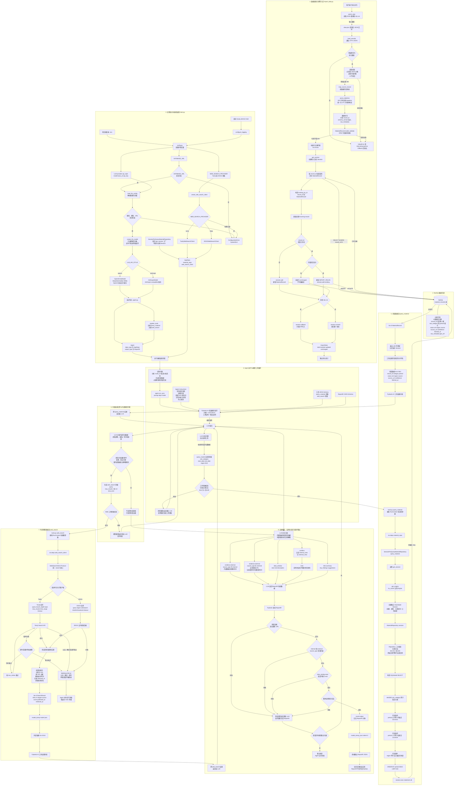

```mermaid
flowchart TB

    %% =========================================================
    %% 1. 数据准备与幂等入库
    %% =========================================================
    subgraph IMPORT["1. 数据准备与幂等入库 import_data.py"]
        direction TB

        I_USER["用户执行导入命令"]
        I_ARGS["parse_args<br/>读取 JSON 路径和 dry-run"]
        I_FILE["data.json 或指定 JSON 文件"]
        I_LOAD["load_records<br/>读取 UTF-8 JSON"]
        I_TOP_CHECK{"顶层是否为<br/>非空数组"}
        I_ROW_CHECK["逐条检查<br/>必须是 JSON 对象<br/>必填字段完整<br/>id 不重复"]
        I_MAP["map_source_record<br/>源数据字段映射"]
        I_TIME["parse_datetime<br/>ISO 字符串转 datetime<br/>统一为 UTC 并移除时区"]
        I_METADATA["数据补充<br/>id 转 record_id<br/>schema_version 放入 raw_metadata"]
        I_MODEL_VALIDATE["MaterialRecord.model_validate<br/>ORM 字段类型校验"]
        I_RECORDS["标准化记录列表<br/>list of dict"]
        I_OPEN_SESSION["get_session<br/>创建导入事务 Session"]
        I_QUERY_EXISTING["按 record_id 批量查询<br/>已有 MaterialRecord"]
        I_EXISTING_MAP["构造 existing_by_id<br/>record_id 到 MaterialRecord"]
        I_NEXT["逐条处理 incoming record"]
        I_EXISTS{"record_id<br/>是否已存在"}
        I_CHANGED{"字段是否变化"}
        I_INSERT["session.add<br/>新增 MaterialRecord"]
        I_UPDATE["更新 IMPORT_FIELDS<br/>session.add existing"]
        I_UNCHANGED["记录为 unchanged<br/>不写数据库"]
        I_DRY{"是否 dry-run"}
        I_ROLLBACK["session.rollback<br/>只统计不写入"]
        I_COMMIT["session.commit<br/>提交整个事务"]
        I_STATS["ImportStats<br/>total inserted updated unchanged"]
        I_PRINT["输出导入统计"]
        I_IMPORT_ERROR["ValueError 或 SQLAlchemyError<br/>rollback 后退出"]

        I_USER --> I_ARGS
        I_ARGS -->|"输入路径"| I_FILE
        I_FILE --> I_LOAD
        I_LOAD --> I_TOP_CHECK
        I_TOP_CHECK -->|"否"| I_IMPORT_ERROR
        I_TOP_CHECK -->|"是"| I_ROW_CHECK
        I_ROW_CHECK -->|"校验失败"| I_IMPORT_ERROR
        I_ROW_CHECK -->|"原始记录 dict"| I_MAP
        I_MAP --> I_TIME
        I_TIME --> I_METADATA
        I_METADATA --> I_MODEL_VALIDATE
        I_MODEL_VALIDATE -->|"校验失败"| I_IMPORT_ERROR
        I_MODEL_VALIDATE -->|"标准字段 dict"| I_RECORDS
        I_RECORDS --> I_OPEN_SESSION
        I_OPEN_SESSION --> I_QUERY_EXISTING
        I_QUERY_EXISTING --> I_EXISTING_MAP
        I_EXISTING_MAP --> I_NEXT
        I_NEXT --> I_EXISTS
        I_EXISTS -->|"否"| I_INSERT
        I_EXISTS -->|"是"| I_CHANGED
        I_CHANGED -->|"是"| I_UPDATE
        I_CHANGED -->|"否"| I_UNCHANGED
        I_INSERT --> I_DRY
        I_UPDATE --> I_DRY
        I_UNCHANGED --> I_DRY
        I_DRY -->|"是"| I_ROLLBACK
        I_DRY -->|"否"| I_COMMIT
        I_ROLLBACK --> I_STATS
        I_COMMIT --> I_STATS
        I_STATS --> I_PRINT
    end

    %% =========================================================
    %% 2. 共享数据存储
    %% =========================================================
    subgraph STORAGE["2. MySQL 数据存储"]
        direction TB

        MYSQL[("MySQL<br/>material_records 表")]
        DB_FIELDS["主要字段<br/>id 数据库主键<br/>record_id 业务唯一键<br/>sub_category 和 period 索引<br/>value unit region source<br/>source_url confidence fetched_at<br/>raw_metadata geo_ref"]
    end

    I_QUERY_EXISTING -->|"SELECT WHERE record_id IN"| MYSQL
    MYSQL -->|"已有记录"| I_QUERY_EXISTING
    I_INSERT -->|"INSERT"| MYSQL
    I_UPDATE -->|"UPDATE"| MYSQL
    MYSQL --- DB_FIELDS

    %% =========================================================
    %% 3. 应用启动和依赖装配
    %% =========================================================
    subgraph STARTUP["3. 应用启动与依赖装配 main.py"]
        direction TB

        S_USER["启动 mysql_demo2.main"]
        S_LOG["configure_logging"]
        S_ENV["项目根目录 .env"]
        S_CONFIG["config.py<br/>读取环境变量"]
        S_DB_CONFIG["DATABASE_URL"]
        S_LLM_CONFIG["LLM provider api_style<br/>model base_url api_key"]
        S_SEARCH_CONFIG["WEB_SEARCH_PROVIDER<br/>Tavily 或 DDGS 参数"]
        S_DB_VALID{"DATABASE_URL<br/>是否存在"}
        S_LOAD_LLM["load_llm_config<br/>解析配置优先级"]
        S_LLM_VALID{"模型、密钥、URL<br/>是否有效"}
        S_MODEL_FACTORY["create_llm_model<br/>只创建模型对象<br/>此时不发送网络请求"]
        S_MODEL_CHOICE{"LLM_API_STYLE"}
        S_OPENAI_MODEL["OpenAIChatModel<br/>DeepSeek Bailian MiMo<br/>OpenAI 或自定义服务"]
        S_ANTHROPIC_MODEL["AnthropicModel<br/>Anthropic-compatible 服务"]
        S_AGENT_IMPORT["延迟导入 agent.py"]
        S_AGENT["Agent<br/>deps_type 为 AppDeps<br/>output_type 为 ReportIR"]
        S_REGISTER["register_tools<br/>注册 query_material<br/>注册 web_search"]
        S_SEARCH_FACTORY["create_web_search_client"]
        S_SEARCH_CHOICE{"WEB_SEARCH_PROVIDER"}
        S_TAVILY["TavilyWebSearchClient"]
        S_DDGS["DDGSWebSearchClient"]
        S_REPO_PROXY["SessionPerQueryMaterialRepository<br/>保存 get_session 工厂<br/>不保存长期 Session"]
        S_DEPS["AppDeps<br/>material_repo<br/>web_search_client"]
        S_READY["运行依赖装配完成"]
        S_CONFIG_ERROR["ConfigurationError<br/>SystemExit"]

        S_USER --> S_LOG
        S_ENV --> S_CONFIG
        S_LOG --> S_CONFIG
        S_CONFIG --> S_DB_CONFIG
        S_CONFIG --> S_LLM_CONFIG
        S_CONFIG --> S_SEARCH_CONFIG

        S_DB_CONFIG --> S_DB_VALID
        S_DB_VALID -->|"否"| S_CONFIG_ERROR
        S_DB_VALID -->|"是"| S_LOAD_LLM

        S_LLM_CONFIG --> S_LOAD_LLM
        S_LOAD_LLM --> S_LLM_VALID
        S_LLM_VALID -->|"否"| S_CONFIG_ERROR
        S_LLM_VALID -->|"是"| S_MODEL_FACTORY
        S_MODEL_FACTORY --> S_MODEL_CHOICE
        S_MODEL_CHOICE -->|"openai"| S_OPENAI_MODEL
        S_MODEL_CHOICE -->|"anthropic"| S_ANTHROPIC_MODEL

        S_OPENAI_MODEL --> S_AGENT_IMPORT
        S_ANTHROPIC_MODEL --> S_AGENT_IMPORT
        S_AGENT_IMPORT --> S_AGENT
        S_AGENT_IMPORT --> S_REGISTER
        S_REGISTER --> S_AGENT

        S_SEARCH_CONFIG --> S_SEARCH_FACTORY
        S_SEARCH_FACTORY --> S_SEARCH_CHOICE
        S_SEARCH_CHOICE -->|"tavily"| S_TAVILY
        S_SEARCH_CHOICE -->|"ddgs"| S_DDGS
        S_SEARCH_CHOICE -->|"配置无效"| S_CONFIG_ERROR

        S_REPO_PROXY --> S_DEPS
        S_TAVILY --> S_DEPS
        S_DDGS --> S_DEPS
        S_AGENT --> S_READY
        S_DEPS --> S_READY
    end

    %% =========================================================
    %% 4. Agent 首次模型请求
    %% =========================================================
    subgraph AGENT_RUN["4. Agent 运行与模型工具循环"]
        direction TB

        A_PROMPT["应用问题<br/>分析 crude_oil 最近价格态势<br/>先查内部数据<br/>必要时搜索外部信息"]
        A_RUN["agent.run_sync<br/>prompt deps model"]
        A_INSTRUCTIONS["Agent instructions<br/>先内部后外部<br/>证据分组<br/>保留 URL 和时间<br/>识别冲突与风险<br/>禁止编造"]
        A_TOOL_SCHEMAS["工具 JSON Schema<br/>query_material 参数<br/>web_search 参数"]
        A_REPORT_SCHEMA["ReportIR JSON Schema"]
        A_FIRST_REQUEST["Pydantic AI 组装模型请求<br/>问题 + instructions<br/>工具结构 + 输出结构"]
        A_LLM["LLM 服务"]
        A_DECISION["LLM 分析问题<br/>决定调用工具"]
        A_QUERY_ARGS["query_material 调用参数<br/>sub_category<br/>start_date end_date<br/>region limit"]
        A_QUERY_ARG_VALIDATE{"工具参数校验<br/>分类必须合法<br/>limit 为 1 到 100"}
        A_QUERY_RETRY["把参数错误反馈给 LLM<br/>请求重新生成工具参数"]

        S_READY --> A_PROMPT
        A_PROMPT --> A_RUN
        A_RUN --> A_FIRST_REQUEST
        A_INSTRUCTIONS --> A_FIRST_REQUEST
        A_TOOL_SCHEMAS --> A_FIRST_REQUEST
        A_REPORT_SCHEMA --> A_FIRST_REQUEST
        A_FIRST_REQUEST -->|"模型请求"| A_LLM
        A_LLM --> A_DECISION
        A_DECISION -->|"按规则先查内部数据"| A_QUERY_ARGS
        A_QUERY_ARGS --> A_QUERY_ARG_VALIDATE
        A_QUERY_ARG_VALIDATE -->|"失败"| A_QUERY_RETRY
        A_QUERY_RETRY --> A_LLM
    end

    %% =========================================================
    %% 5. 内部 MySQL 查询工具流
    %% =========================================================
    subgraph INTERNAL_QUERY["5. 内部数据流 query_material"]
        direction TB

        Q_TOOL["tools.py query_material<br/>接收 RunContext 和查询参数"]
        Q_CONTEXT["ctx.deps.material_repo"]
        Q_PROXY["SessionPerQueryMaterialRepository<br/>query_material"]
        Q_SESSION_FACTORY["调用 get_session"]
        Q_ENGINE["get_engine<br/>lru_cache 复用 Engine"]
        Q_SESSION["创建独立 SQLModel Session<br/>创建、使用、关闭在同一工作线程"]
        Q_REPOSITORY["MaterialRepository session"]
        Q_VALIDATE["Repository 二次校验<br/>分类合法<br/>limit 为 1 到 100<br/>开始日期不晚于结束日期"]
        Q_SELECT["构造 SQLModel SELECT"]
        Q_CATEGORY["WHERE sub_category 等于指定分类"]
        Q_START["可选条件<br/>period 大于等于开始日 00:00:00"]
        Q_END["可选条件<br/>period 小于等于结束日 23:59:59"]
        Q_REGION["可选条件<br/>region 等于去空格后的地区"]
        Q_ORDER["ORDER BY period DESC<br/>LIMIT limit"]
        Q_EXEC["session.exec statement all"]
        Q_ORM_ROWS["list of MaterialRecord"]
        Q_CLOSE["退出 with 作用域<br/>关闭当前 Session"]
        Q_REDUCE["工具结果字段裁剪与序列化"]
        Q_DICTS["内部数据 list of dict<br/>record_id category period<br/>value unit region source<br/>source_url confidence fetched_at"]
        Q_TOOL_RESULT["Pydantic AI 工具结果消息"]

        A_QUERY_ARG_VALIDATE -->|"成功"| Q_TOOL
        Q_TOOL --> Q_CONTEXT
        Q_CONTEXT --> Q_PROXY
        Q_PROXY --> Q_SESSION_FACTORY
        Q_SESSION_FACTORY --> Q_ENGINE
        Q_ENGINE --> Q_SESSION
        Q_SESSION --> Q_REPOSITORY
        Q_REPOSITORY --> Q_VALIDATE
        Q_VALIDATE --> Q_SELECT
        Q_SELECT --> Q_CATEGORY
        Q_CATEGORY --> Q_START
        Q_START --> Q_END
        Q_END --> Q_REGION
        Q_REGION --> Q_ORDER
        Q_ORDER --> Q_EXEC
        Q_EXEC -->|"参数化 SQL"| MYSQL
        MYSQL -->|"查询行"| Q_ORM_ROWS
        Q_ORM_ROWS --> Q_CLOSE
        Q_CLOSE --> Q_REDUCE
        Q_REDUCE --> Q_DICTS
        Q_DICTS --> Q_TOOL_RESULT
    end

    %% =========================================================
    %% 6. 内部数据分析和外部搜索判断
    %% =========================================================
    subgraph SEARCH_DECISION["6. 内部结果回传与外部搜索判断"]
        direction TB

        D_SEND_INTERNAL["把 query_material 结果<br/>返回给 LLM"]
        D_REASON["LLM 分析内部历史数据<br/>提取趋势、数值、时间和来源"]
        D_NEED_WEB{"是否涉及最新事件<br/>政策、供应中断<br/>或内部数据无法解释原因"}
        D_NO_WEB["不调用外部搜索<br/>只使用内部证据"]
        D_WEB_ARGS["生成 web_search 参数<br/>query<br/>max_results 1 到 10<br/>time_limit"]
        D_WEB_VALIDATE{"Web 工具参数校验"}
        D_WEB_RETRY["把参数错误反馈给 LLM<br/>请求修正"]

        Q_TOOL_RESULT --> D_SEND_INTERNAL
        D_SEND_INTERNAL --> A_LLM
        A_LLM --> D_REASON
        D_REASON --> D_NEED_WEB
        D_NEED_WEB -->|"否"| D_NO_WEB
        D_NEED_WEB -->|"是"| D_WEB_ARGS
        D_WEB_ARGS --> D_WEB_VALIDATE
        D_WEB_VALIDATE -->|"失败"| D_WEB_RETRY
        D_WEB_RETRY --> A_LLM
    end

    %% =========================================================
    %% 7. 外部 Web Search 数据流
    %% =========================================================
    subgraph WEB_SEARCH["7. 外部搜索数据流 web_search"]
        direction TB

        W_TOOL["tools.py web_search<br/>接收 RunContext 和搜索参数"]
        W_CONTEXT["ctx.deps.web_search_client"]
        W_PROTOCOL["WebSearchClient Protocol<br/>统一 search 接口"]
        W_CLIENT_CHOICE{"启动时注入的客户端"}
        W_TAVILY_REQUEST["Tavily 请求<br/>query search_depth topic<br/>max_results time_range timeout"]
        W_TAVILY_API["Tavily Search API"]
        W_TAVILY_RETRY{"超时或临时网络故障"}
        W_TAVILY_AGAIN["按 max_retries 重试"]
        W_DDGS_REQUEST["DDGS 请求<br/>query region safesearch<br/>timelimit backend timeout"]
        W_DDGS_BACKEND["DDGS 公开搜索后端"]
        W_RAW["供应商原始搜索结果"]
        W_NORMALIZE["结果标准化<br/>过滤空 URL<br/>按 URL 去重<br/>解析发布时间<br/>记录 retrieved_at<br/>提取来源域名"]
        W_RESULTS["list of SearchResult<br/>title url snippet source<br/>score published_at retrieved_at"]
        W_DUMP["model_dump mode=json"]
        W_DICTS["外部证据 list of dict"]
        W_RESULT_MSG["Pydantic AI 工具结果消息"]
        W_ERROR["WebSearchError<br/>认证、额度、超时<br/>网络或请求被拒绝"]
        W_RUN_FAIL["Agent 本次运行失败<br/>错误向 main 传播"]

        D_WEB_VALIDATE -->|"成功"| W_TOOL
        W_TOOL --> W_CONTEXT
        W_CONTEXT --> W_PROTOCOL
        W_PROTOCOL --> W_CLIENT_CHOICE

        W_CLIENT_CHOICE -->|"Tavily"| W_TAVILY_REQUEST
        W_TAVILY_REQUEST --> W_TAVILY_API
        W_TAVILY_API -->|"成功"| W_RAW
        W_TAVILY_API -->|"临时失败"| W_TAVILY_RETRY
        W_TAVILY_RETRY -->|"仍可重试"| W_TAVILY_AGAIN
        W_TAVILY_AGAIN --> W_TAVILY_API
        W_TAVILY_RETRY -->|"重试耗尽"| W_ERROR
        W_TAVILY_API -->|"认证、额度或请求错误"| W_ERROR

        W_CLIENT_CHOICE -->|"DDGS"| W_DDGS_REQUEST
        W_DDGS_REQUEST --> W_DDGS_BACKEND
        W_DDGS_BACKEND -->|"成功"| W_RAW
        W_DDGS_BACKEND -->|"失败"| W_ERROR

        W_RAW --> W_NORMALIZE
        W_NORMALIZE --> W_RESULTS
        W_RESULTS --> W_DUMP
        W_DUMP --> W_DICTS
        W_DICTS --> W_RESULT_MSG
        W_ERROR --> W_RUN_FAIL
    end

    %% =========================================================
    %% 8. 证据融合和 ReportIR 输出
    %% =========================================================
    subgraph REPORT_FLOW["8. 证据融合、结构化校验与最终输出"]
        direction TB

        R_SEND_EXTERNAL["把 web_search 结果<br/>返回给 LLM"]
        R_SYNTHESIS["LLM 综合分析<br/>内部数据形成趋势依据<br/>外部搜索补充近期解释"]
        R_INTERNAL_EVIDENCE["evidence.internal<br/>source_type 为 internal<br/>内部数据来源和时间"]
        R_EXTERNAL_EVIDENCE["evidence.external<br/>source_type 为 external<br/>必须保留 URL<br/>记录发布时间或检索时间"]
        R_WINDOW["data_window<br/>start end description"]
        R_CONFLICT["conflicts<br/>比较 internal_view<br/>与 external_view"]
        R_RISKS["risks<br/>说明冲突和不确定性的影响"]
        R_OTHER["title summary<br/>key_findings suggestions"]
        R_JSON["LLM 返回 ReportIR 候选数据"]
        R_PYDANTIC["Pydantic 校验 ReportIR"]
        R_URL_CHECK{"外部证据<br/>是否都有 URL"}
        R_GROUP_CHECK{"internal 和 external<br/>source_type 是否匹配"}
        R_TIME_CHECK{"data_window.start<br/>是否不晚于 end"}
        R_VALID{"整体结构是否合法"}
        R_RETRY["将校验错误反馈给 LLM<br/>请求重新生成 ReportIR"]
        R_RETRY_LIMIT{"是否还有模型重试次数"}
        R_OUTPUT["result.output<br/>合法 ReportIR 对象"]
        R_SERIALIZE["model_dump_json indent=2"]
        R_STDOUT["终端输出 ReportIR JSON"]
        R_NO_SAVE["当前实现到此结束<br/>ReportIR 不会写回 MySQL"]
        R_FAIL["重试耗尽<br/>Agent 运行失败"]

        D_NO_WEB --> R_SYNTHESIS
        W_RESULT_MSG --> R_SEND_EXTERNAL
        R_SEND_EXTERNAL --> A_LLM
        A_LLM --> R_SYNTHESIS

        R_SYNTHESIS --> R_INTERNAL_EVIDENCE
        R_SYNTHESIS --> R_EXTERNAL_EVIDENCE
        R_SYNTHESIS --> R_WINDOW
        R_SYNTHESIS --> R_CONFLICT
        R_CONFLICT --> R_RISKS
        R_SYNTHESIS --> R_OTHER

        R_INTERNAL_EVIDENCE --> R_JSON
        R_EXTERNAL_EVIDENCE --> R_JSON
        R_WINDOW --> R_JSON
        R_RISKS --> R_JSON
        R_OTHER --> R_JSON

        R_JSON --> R_PYDANTIC
        R_PYDANTIC --> R_URL_CHECK
        R_URL_CHECK -->|"失败"| R_RETRY
        R_URL_CHECK -->|"成功"| R_GROUP_CHECK
        R_GROUP_CHECK -->|"失败"| R_RETRY
        R_GROUP_CHECK -->|"成功"| R_TIME_CHECK
        R_TIME_CHECK -->|"失败"| R_RETRY
        R_TIME_CHECK -->|"成功"| R_VALID
        R_VALID -->|"失败"| R_RETRY
        R_VALID -->|"成功"| R_OUTPUT

        R_RETRY --> R_RETRY_LIMIT
        R_RETRY_LIMIT -->|"有"| A_LLM
        R_RETRY_LIMIT -->|"无"| R_FAIL

        R_OUTPUT --> R_SERIALIZE
        R_SERIALIZE --> R_STDOUT
        R_STDOUT -.-> R_NO_SAVE
    end
```