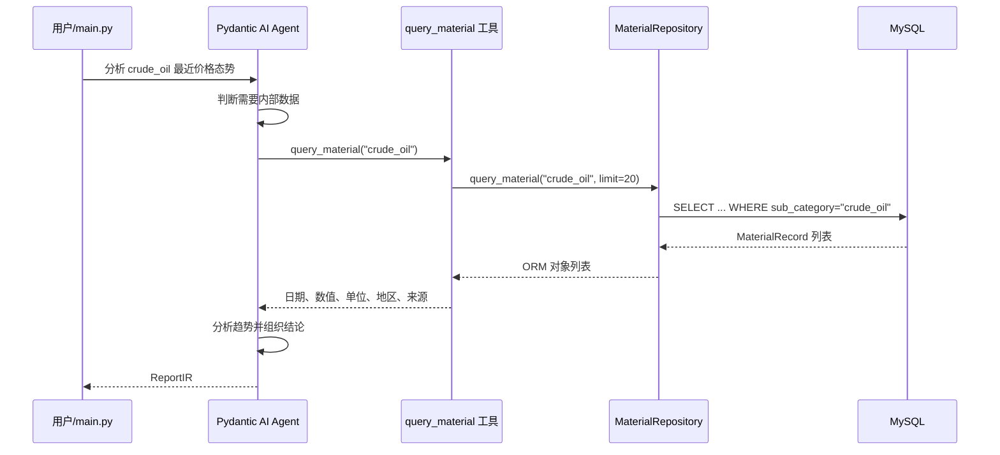
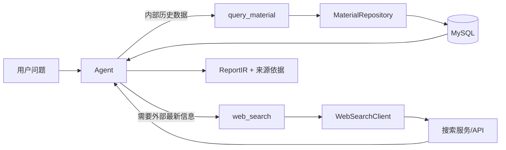

# MySQL 物资态势分析 Agent：从零理解当前最小闭环

这是一份面向初学者的项目说明。你不需要预先了解 Agent、ORM、依赖注入或工具调用；本文会从“这个项目到底在做什么”开始，逐步解释代码如何协作、数据如何流动、目前已经完成什么，以及下一步如何加入 `web_search()`。

---

## 1. 先用一句话理解项目

当前项目允许大语言模型接收一个物资分析问题，在需要数据时主动调用 Python 工具，从 MySQL 的 `material_records` 表查询内部数据，最后按照固定的 `ReportIR` 格式生成一份结构化简报。

例如，当前 `main.py` 提出的问题是：

> 分析 `crude_oil` 最近价格态势，生成简报。

理想情况下，Agent 会完成下面这条链路：

```text
用户问题
  → DeepSeek Agent 理解任务
  → Agent 调用 query_material 工具
  → Repository 查询 MySQL
  → 数据返回给 Agent
  → Agent 分析数据
  → 输出固定结构的 ReportIR
```

这就是当前项目的“最小闭环”。

所谓闭环，是指问题不是只进入模型就结束，而是能够：

1. 接收问题；
2. 判断需要什么数据；
3. 通过工具取得真实数据；
4. 根据真实数据完成分析；
5. 输出程序可以继续使用的结构化结果。

---

## 2. 当前进度总览

### 已经完成

- Python 项目和虚拟环境已经建立。
- 已连接本机 MySQL 数据库。
- 已定义 `material_records` 对应的 SQLModel ORM 模型。
- 已把 `data.json` 的 20 条元数据导入数据库。
- 已实现幂等导入器：重复运行不会制造重复记录。
- 已实现 Repository 数据访问层。
- 已实现 Agent 内部工具 `query_material()`。
- 已通过依赖注入把 Repository 提供给 Agent 工具。
- 已定义结构化输出模型 `ReportIR`。
- 已配置 DeepSeek 模型名称和 `.env` 加载逻辑。
- 已验证内部数据库查询链路。

当前数据库中共有 20 条记录：

| `sub_category` | 数量 | 含义 |
|---|---:|---|
| `crude_oil` | 7 | WTI 原油价格 |
| `surface_weather` | 7 | 上海地表天气/温度 |
| `food_price_index` | 6 | FAO 食品价格指数 |

### 尚未完成

- 尚未实现真正的 `web_search()` Python 工具。
- 尚未把外部搜索客户端加入 `AppDeps`。
- 尚未定义外部搜索结果的统一数据结构。
- 尚未实现来源去重、可信度筛选、引用和超时重试。
- 尚未提供 Web API 或前端界面。
- 尚未建立正式的自动化测试套件。
- 数据库连接信息目前仍写在代码中，后续应迁移到 `.env`。
- 尚未使用数据库迁移工具管理表结构。

特别注意：`agent.py` 的提示词虽然写了“必要时搜索外部信息”，但提示词只是给模型的工作说明。代码里目前没有注册 `web_search()`，所以 Agent 现在无法真正执行外部搜索。

---

## 3. 项目结构

```text
poc3-1/
├─ .env                         # 本机私密配置，不应提交到 Git
├─ .env.example                 # 配置模板，绝对不能放真实密钥
├─ pyproject.toml               # Python 版本和直接依赖
├─ uv.lock                      # 精确锁定所有依赖版本
└─ mysql_demo/
   ├─ README.md                 # 你正在阅读的文档
   ├─ main.py                   # 应用主入口
   ├─ config.py                 # 加载和校验 DeepSeek 配置
   ├─ agent.py                  # 定义 Agent、模型、提示词和输出类型
   ├─ tools.py                  # 注册 Agent 可以调用的工具
   ├─ deps.py                   # 定义注入给 Agent 的依赖
   ├─ repository.py             # 封装数据库查询
   ├─ database.py               # 创建数据库 Engine 和 Session
   ├─ models.py                 # material_records 的 ORM 模型
   ├─ report.py                 # Agent 的结构化输出模型
   ├─ data.json                 # 20 条原始元数据
   ├─ import_data.py            # 校验并幂等导入 data.json
   └─ test_mysql.py             # 最简单的数据库查询检查
```

你可以先把这些文件分成四层：

| 层 | 文件 | 负责什么 |
|---|---|---|
| 应用编排层 | `main.py` | 把所有组件组装起来并启动一次任务 |
| Agent 层 | `agent.py`、`tools.py`、`deps.py`、`report.py` | 模型推理、工具调用、依赖和输出约束 |
| 数据访问层 | `repository.py`、`database.py`、`models.py` | 连接 MySQL、生成 SQL、返回数据 |
| 数据准备层 | `data.json`、`import_data.py` | 校验并把源数据写入数据库 |

---

## 4. 最小闭环是如何实现的

下面用一次真实调用解释所有组件如何协作。



### 第 1 步：`main.py` 启动

`main.py` 是当前应用入口。它主要做四件事：

1. 检查 `DEEPSEEK_API_KEY`；
2. 创建数据库 Session；
3. 创建 Repository 和 `AppDeps`；
4. 调用 `agent.run_sync()`。

这里没有把数据库查询代码直接写在 `main.py` 中，因为我们希望每一层只承担一种职责。

### 第 2 步：建立数据库 Session

`database.py` 使用 SQLModel 创建：

- `engine`：数据库连接引擎；
- `Session`：一次数据库工作会话。

可以把 Engine 理解成“数据库连接工厂”，把 Session 理解成“一次操作数据库的工作台”。

`main.py` 使用：

```python
with get_session() as session:
    ...
```

这样离开 `with` 代码块时，Session 会被关闭，连接可以被连接池回收。

### 第 3 步：创建 Repository

`MaterialRepository` 接收 Session：

```python
repo = MaterialRepository(session)
```

Repository 的作用是隐藏 SQL 查询细节。业务层只需要说：

```python
repo.query_material("crude_oil")
```

而不需要到处重复：

```python
select(MaterialRecord).where(...).order_by(...).limit(...)
```

当前查询逻辑是：

1. 根据 `sub_category` 精确匹配；
2. 按 `period` 从新到旧排序；
3. 默认最多返回 20 条。

### 第 4 步：把 Repository 放入 `AppDeps`

`deps.py` 中定义：

```python
@dataclass
class AppDeps:
    material_repo: MaterialRepository
```

然后 `main.py` 创建：

```python
deps = AppDeps(material_repo=repo)
```

这叫“依赖注入”。

简单理解：工具需要 Repository，但工具不自己创建 Repository，而是由 `main.py` 提前准备好，再传进去。

这样做有三个好处：

- 工具不需要知道数据库密码和连接方式；
- 测试时可以传入假的 Repository；
- 以后增加 `web_search_client` 时，可以继续放到 `AppDeps`。

### 第 5 步：Agent 接收问题

`agent.py` 定义了一个 Pydantic AI `Agent`，它包含：

- 使用哪个模型：`DEEPSEEK_MODEL`；
- 工具运行时需要什么依赖：`AppDeps`；
- 最终必须输出什么结构：`ReportIR`；
- 系统工作说明：先查询数据库、分析变化、必要时搜索、禁止编造。

`defer_model_check=True` 表示模块导入时先不立即创建外部模型连接。这样即使本机还没配置 Key，其他不依赖模型的模块也能正常导入和测试。

### 第 6 步：模型决定调用工具

`tools.py` 使用 `@agent.tool` 注册 `query_material()`。

模型看到工具名称、参数和文档后，可以生成类似下面的工具调用：

```text
query_material(sub_category="crude_oil")
```

注意：大模型不能直接执行 Python，也不能直接访问 MySQL。它只能提出“我要调用这个工具”。Pydantic AI 收到工具调用请求后，才会真正执行对应的 Python 函数。

### 第 7 步：工具取得依赖并查询数据库

工具函数接收：

```python
ctx: RunContext[AppDeps]
```

通过下面这行拿到 `main.py` 注入的 Repository：

```python
repo = ctx.deps.material_repo
```

然后调用：

```python
records = repo.query_material(sub_category)
```

### 第 8 步：把 ORM 对象转换成模型容易理解的数据

Repository 返回的是 `MaterialRecord` ORM 对象。工具不会把整个对象直接交给模型，而是选择必要字段：

```python
{
    "period": str(r.period),
    "value": r.value,
    "unit": r.unit,
    "region": r.region,
    "source": r.source,
}
```

这一步很重要，因为：

- 减少发送给模型的 Token；
- 避免暴露无关字段；
- 让模型收到的结构更稳定；
- 后续可以在工具层统一处理空值和格式。

### 第 9 步：输出 `ReportIR`

`report.py` 使用 Pydantic 定义最终结果：

```python
class ReportIR(BaseModel):
    title: str
    summary: str
    key_findings: list[str]
    risks: list[str]
    suggestions: list[str]
```

这意味着最终输出不能只是任意自然语言，而必须包含：

- 标题；
- 摘要；
- 关键发现；
- 风险；
- 建议。

这叫“结构化输出”。它比普通文本更适合：

- 保存到数据库；
- 返回给 API；
- 渲染到网页；
- 生成 PDF；
- 被另一个程序继续处理。

---

## 5. 每个文件的职责

### `main.py`：总装配入口

它负责连接所有组件，但不负责实现数据库查询和分析逻辑。

你可以把它理解成导演：

- Session 是数据库工作环境；
- Repository 是数据管理员；
- `AppDeps` 是工具箱；
- Agent 是分析员；
- `ReportIR` 是最终报告模板。

运行方式：

```powershell
E:\code\poc3-1\.venv\Scripts\python.exe E:\code\poc3-1\mysql_demo\main.py
```

### `config.py`：配置加载与检查

它从项目根目录读取 `.env`，并提供：

- `DEEPSEEK_MODEL`；
- `require_deepseek_api_key()`；
- `ConfigurationError`。

当前默认模型名为：

```text
deepseek:deepseek-v4-pro
```

真实 API Key 不应该出现在 Python 源码里，也不应该放在 `.env.example` 中。

### `agent.py`：定义 Agent

这里定义：

- 模型；
- 依赖类型；
- 输出类型；
- Agent 工作说明；
- 工具注册。

`agent.py` 不创建 Session，也不直接查询数据库。这些外部资源由运行入口注入。

### `tools.py`：Agent 的可执行能力

当前只有一个工具：

```text
query_material(sub_category: str)
```

支持的分类：

- `crude_oil`
- `food_price_index`
- `surface_weather`

工具是“模型世界”和“真实程序世界”之间的桥梁。

提示词只能告诉模型应该做什么，工具才能让模型真正做到。

### `deps.py`：依赖容器

当前只包含：

```text
material_repo
```

未来加入 Web Search 后，这里可能变为：

```python
@dataclass
class AppDeps:
    material_repo: MaterialRepository
    web_search_client: WebSearchClient
```

上面只是未来设计示意，当前代码中还没有 `WebSearchClient`。

### `repository.py`：数据访问层

它负责构造 SQLModel 查询并返回 `MaterialRecord`。

为什么不让工具直接写 SQL？

- 查询规则集中管理；
- 以后更换数据库实现时影响更小；
- 更容易测试；
- 防止 Agent 工具和数据库细节绑死。

### `database.py`：连接数据库

当前使用的连接协议是：

```text
mysql+pymysql
```

含义是：

- 数据库是 MySQL；
- SQLAlchemy/SQLModel 使用 PyMySQL 作为底层驱动。

连接 URL 的通用格式是：

```text
mysql+pymysql://用户名:密码@主机:端口/数据库名
```

当前连接 URL 仍直接写在 `database.py`，适合学习演示，但不适合生产环境。后续应改成：

```dotenv
DATABASE_URL=mysql+pymysql://...
```

再由 `config.py` 读取。

Engine 还配置了：

- `echo=True`：把 SQL 打印到终端，方便学习和排错；
- `pool_pre_ping=True`：使用连接前先确认连接仍有效；
- `pool_recycle=3600`：定期回收旧连接，减少 MySQL 主动断开连接带来的问题。

### `models.py`：ORM 模型

`MaterialRecord` 同时承担两件事：

1. 用 Python 类型描述一条物资记录；
2. 映射 MySQL 的 `material_records` 表。

主要字段：

| 字段 | Python 类型 | 作用 |
|---|---|---|
| `id` | `int \| None` | 数据库自增主键 |
| `record_id` | `str` | 源记录唯一 ID，防止重复 |
| `category` | `str \| None` | 大类，如 energy |
| `sub_category` | `str \| None` | 子类，也是当前主要查询条件 |
| `region` | `str \| None` | 地区 |
| `metric_type` | `str \| None` | 指标类型 |
| `value` | `float \| None` | 指标数值 |
| `unit` | `str \| None` | 单位 |
| `period` | `datetime \| None` | 数据所属时间 |
| `source` | `str \| None` | 数据来源 |
| `source_url` | `str \| None` | 来源地址 |
| `confidence` | `str \| None` | 可信度标签 |
| `geo_scale` | `str \| None` | 地理粒度 |
| `mom_change` | `float \| None` | 环比变化 |
| `yoy_change` | `float \| None` | 同比变化 |
| `fetched_at` | `datetime \| None` | 抓取时间 |
| `raw_metadata` | `dict \| None` | 来源特有的扩展元数据 |
| `geo_ref` | `dict \| None` | 地理定位扩展信息 |

`raw_metadata` 和 `geo_ref` 使用 MySQL JSON 类型，可以保存不同来源不完全一致的扩展字段。

### `report.py`：最终报告协议

`ReportIR` 中的 `IR` 可以理解为 Intermediate Representation，即“中间标准表示”。

无论模型内部如何推理，输出都被统一为一个固定协议。以后 Web API、页面或文件生成模块只需要认识 `ReportIR`，不需要理解模型的自由文本。

### `data.json`：源元数据

当前包含 20 条数据。源 JSON 使用 `id`，数据库模型使用 `record_id`。

导入器会完成映射：

```text
data.json.id → material_records.record_id
```

源数据中的 `schema_version` 没有单独数据库列，因此被保存在：

```text
raw_metadata.schema_version
```

### `import_data.py`：幂等导入器

导入器会：

1. 读取 UTF-8 JSON；
2. 检查顶层必须是数组；
3. 检查必填字段；
4. 检查 ID 是否为空或重复；
5. 解析 ISO 日期；
6. 把带时区时间统一转为 UTC；
7. 使用 ORM 做最终类型校验；
8. 根据 `record_id` 查询已有记录；
9. 新记录插入，变化记录更新，无变化记录跳过；
10. 使用一个事务提交整批数据。

“幂等”表示同一份数据重复执行多次，最终数据库状态不会不断变化。

当前第二次导入的结果是：

```text
新增 0，更新 0，未变化 20
```

### `test_mysql.py`：最简单的数据库冒烟检查

它直接查询整张表并打印：

- `sub_category`
- `value`

它适合快速确认数据库是否可连接、表是否有数据，但还不是正式的自动化测试。

---

## 6. 当前使用的技术和必须理解的知识

### Python 3.14

项目要求 Python `>=3.14`。Python 负责：

- 读取配置和 JSON；
- 定义 Agent；
- 执行工具；
- 查询数据库；
- 校验输入输出。

### uv

`uv` 是 Python 项目和依赖管理工具。

这里有两个关键文件：

- `pyproject.toml`：声明项目直接需要什么；
- `uv.lock`：锁定所有直接和间接依赖的精确版本。

同步环境：

```powershell
cd E:\code\poc3-1
uv sync
```

### MySQL

MySQL 是内部结构化数据的持久化存储。

当前项目假设以下资源已经存在：

- MySQL 服务；
- `material_intelligence` 数据库；
- `material_records` 表。

当前 Python 代码不会自动创建数据库和表。

### PyMySQL

PyMySQL 是 Python 和 MySQL 之间的底层驱动。

SQLModel 不会自己通过网络连接 MySQL，而是借助 SQLAlchemy，再由 SQLAlchemy 使用 PyMySQL。

### SQLAlchemy

SQLAlchemy 提供：

- Engine；
- 连接池；
- Session；
- SQL 表达式；
- ORM 基础能力；
- 事务。

### SQLModel

SQLModel 建立在 SQLAlchemy 和 Pydantic 之上。

它让同一个 Python 类既可以表达数据类型，又可以映射数据库表。

例如：

```python
select(MaterialRecord).where(
    MaterialRecord.sub_category == "crude_oil"
)
```

SQLModel/SQLAlchemy 会把它转换成 SQL。

### ORM

ORM 是 Object-Relational Mapping，即“对象关系映射”。

数据库中的一行会变成一个 Python 对象：

```python
record.value
record.period
record.source
```

你不需要自己把每个 SQL 结果元组转换成字典。

### Session 和事务

Session 代表一次数据库操作上下文。

事务保证一批写入要么全部成功，要么全部回滚。`import_data.py` 在导入过程中只在最后 `commit()`；中间任何错误都会 `rollback()`。

### Pydantic

Pydantic 根据 Python 类型进行数据校验和转换。

当前主要用于：

- 校验 `MaterialRecord` 导入字段；
- 约束 Agent 最终输出为 `ReportIR`。

### Pydantic AI

Pydantic AI 是 Agent 编排框架。它负责：

- 调用模型；
- 把工具定义提供给模型；
- 接收模型发出的工具调用；
- 执行 Python 工具；
- 把工具结果送回模型；
- 校验最终结构化输出；
- 管理运行上下文和依赖。

### Tool Calling

Tool Calling 的本质不是模型自己执行函数，而是一个协议：

1. 模型输出“希望调用哪个工具、参数是什么”；
2. 框架验证参数；
3. Python 执行工具；
4. 框架把结果发回模型；
5. 模型继续推理或输出答案。

### 依赖注入

依赖注入的核心思想是：

> 一个组件需要资源时，不要在组件内部偷偷创建，而由外部明确传入。

当前注入的是 `MaterialRepository`。未来还可以注入：

- Web Search 客户端；
- 日志器；
- 缓存；
- 用户身份；
- 请求追踪 ID。

### Structured Output

结构化输出表示模型必须按程序定义的 Schema 返回结果。

优势：

- 字段稳定；
- 自动校验；
- 更容易保存和展示；
- 下游不用解析自然语言。

---

## 7. 从零运行项目
### 创建数据库和表
-- 1. 创建数据库（如果不存在）
```sql
CREATE DATABASE IF NOT EXISTS `material_intelligence`
    CHARACTER SET utf8mb4
    COLLATE utf8mb4_unicode_ci;
```
-- 2. 使用该数据库
```sql
USE `material_intelligence`;
```

以下命令均以 Windows PowerShell 为例。

### 第 1 步：进入项目

```powershell
cd E:\code\poc3-1
```

### 第 2 步：同步依赖

```powershell
uv sync
```

如果环境已经同步，可以跳过。

为了避免 PowerShell 激活脚本执行策略问题，后面的示例直接使用虚拟环境解释器，不要求执行 `Activate.ps1`。

### 第 3 步：确认 MySQL

确认：

- MySQL 服务已启动；
- 数据库连接信息正确；
- `material_intelligence.material_records` 已存在。

可以在 MySQL 客户端执行：

```sql
USE material_intelligence;
SELECT COUNT(*) FROM material_records;
SELECT sub_category, COUNT(*)
FROM material_records
GROUP BY sub_category;
```

当前预期总数是 20。

### 第 4 步：配置 DeepSeek

项目根目录应该有 `.env`：

```dotenv
DEEPSEEK_API_KEY=你的真实密钥
DEEPSEEK_MODEL=deepseek:deepseek-v4-pro
```

安全规则：

- `.env` 只保存在本机；
- `.env` 已加入 `.gitignore`；
- `.env.example` 中只能保留空值或占位符；
- 不要把 Key 发到聊天、截图、日志或 GitHub；
- 如果 Key 曾出现在 `.env.example` 或 Git 历史中，应立即在平台撤销并生成新 Key。

### 第 5 步：预检数据导入

```powershell
E:\code\poc3-1\.venv\Scripts\python.exe `
  E:\code\poc3-1\mysql_demo\import_data.py `
  --dry-run
```

`--dry-run` 只校验和统计，不写数据库。

当前数据已导入，因此预期类似：

```text
预检完成：总计 20，新增 0，更新 0，未变化 20
```

### 第 6 步：正式导入或同步

```powershell
E:\code\poc3-1\.venv\Scripts\python.exe `
  E:\code\poc3-1\mysql_demo\import_data.py
```

如果修改了 `data.json`：

- 新 ID 会插入；
- 已有 ID 且字段变化会更新；
- 完全相同会跳过。

### 第 7 步：只检查 MySQL 查询

```powershell
E:\code\poc3-1\.venv\Scripts\python.exe `
  E:\code\poc3-1\mysql_demo\test_mysql.py
```

看到分类和数值，说明：

- Python 能连接 MySQL；
- 数据库和表存在；
- ORM 查询可以执行；
- 表中已有数据。

这个步骤不需要 DeepSeek API。

### 第 8 步：运行完整 Agent

```powershell
E:\code\poc3-1\.venv\Scripts\python.exe `
  E:\code\poc3-1\mysql_demo\main.py
```

这一步需要：

- MySQL 正常；
- 数据已经导入；
- `.env` 中有有效 Key；
- 当前模型账号可用；
- 网络能够访问模型服务。

---

## 8. 如何判断是哪一层出了问题

建议从底层到上层逐层排查。

```text
第 1 层：Python 是否能启动
第 2 层：依赖是否安装
第 3 层：MySQL 是否连接
第 4 层：表中是否有数据
第 5 层：Repository 是否返回记录
第 6 层：Agent 工具是否能调用
第 7 层：外部模型是否可用
第 8 层：ReportIR 是否校验通过
```

### 快速检查 Python 语法

```powershell
E:\code\poc3-1\.venv\Scripts\python.exe `
  -m compileall -q E:\code\poc3-1\mysql_demo
```

### 快速检查导入数据

```powershell
E:\code\poc3-1\.venv\Scripts\python.exe `
  E:\code\poc3-1\mysql_demo\import_data.py `
  --dry-run
```

### 快速检查数据库

```powershell
E:\code\poc3-1\.venv\Scripts\python.exe `
  E:\code\poc3-1\mysql_demo\test_mysql.py
```

### 最后才检查 Agent

```powershell
E:\code\poc3-1\.venv\Scripts\python.exe `
  E:\code\poc3-1\mysql_demo\main.py
```

这样排查的好处是：如果数据库测试已经失败，就不用先怀疑大模型。

---

## 9. 常见错误和解决方法

### `未检测到 DEEPSEEK_API_KEY`

原因：

- 项目根目录没有 `.env`；
- `.env` 中变量名写错；
- Key 值为空。

解决：

```dotenv
DEEPSEEK_API_KEY=你的真实密钥
```

不要把真实 Key 写进 `.env.example`。

### 模型返回 401 或认证失败

原因可能是：

- Key 不正确；
- Key 已撤销；
- 账户无权限；
- Key 前后有多余空格。

应在模型服务平台重新生成 Key，不要在聊天中发送 Key。

### `Can't connect to MySQL server`

原因可能是：

- MySQL 服务未启动；
- 主机或端口错误；
- 防火墙拦截；
- MySQL 没有监听目标地址。

先用 MySQL 客户端确认同样的连接信息能否登录。

### `Access denied for user`

原因：

- 用户名或密码错误；
- 用户没有从当前主机登录的权限；
- 用户没有目标数据库权限。

需要检查 MySQL 用户和授权。

### `Unknown database`

说明 `material_intelligence` 数据库不存在，或连接 URL 中数据库名不正确。

### `Table 'material_records' doesn't exist`

当前代码不会自动建表。需要先创建正确的表结构，再运行导入器。

### 查询成功但返回空列表

依次检查：

1. 表中是否有数据；
2. `sub_category` 是否精确写成支持的值；
3. 是否误写了 `oil`、`WTI` 等别名；
4. `data.json` 是否已正式导入。

当前查询是精确匹配，不会自动把 `WTI` 转换成 `crude_oil`。

### `ModuleNotFoundError`

当前代码使用同目录导入方式，建议直接运行脚本的完整路径：

```powershell
E:\code\poc3-1\.venv\Scripts\python.exe `
  E:\code\poc3-1\mysql_demo\main.py
```

不要随意从其他目录复制单个 Python 文件运行。

### 终端中文乱码

可以尝试：

```powershell
chcp 65001
$env:PYTHONUTF8 = "1"
```

同时确保源文件和终端使用 UTF-8。

### 为什么终端打印很多 SQL

因为 `database.py` 设置了：

```python
echo=True
```

这是为了学习和排错。生产环境通常会设为 `False`，再使用正式日志系统。

---

## 10. 当前设计的优点和局限

### 优点

- 数据来自真实数据库，不依赖模型记忆。
- 工具只能执行预先注册的查询，边界相对清晰。
- Repository 隔离了数据库细节。
- `AppDeps` 让资源依赖显式可见。
- `ReportIR` 让输出结构稳定。
- 数据导入支持事务和幂等。
- 模块之间职责已经初步分离。

### 局限

- 数据量目前只有 20 条，只能证明链路，不代表生产效果。
- 数据库连接配置仍硬编码。
- `query_material` 只有一个精确分类过滤条件。
- 没有日期范围、地区、来源、分页等查询参数。
- 没有计算环比和同比。
- 没有工具输入枚举校验。
- 没有 Web Search。
- 没有正式日志、指标、链路追踪。
- 没有自动化单元测试和集成测试。
- 没有 Alembic 等数据库迁移工具。
- 当前是同步命令行程序，不是 API 服务。

---

## 11. 未来加入 `web_search()` 的正确位置

外部搜索不应该直接写进 `repository.py`，因为 Repository 负责内部数据库，而 Web Search 是另一种数据来源。

推荐架构：



### 推荐的新增组件

#### `web_search_client.py`

负责：

- 调用具体搜索服务；
- 设置超时；
- 处理认证；
- 重试临时失败；
- 把不同服务的响应统一成固定结构。

#### `SearchResult`

建议为每条结果定义结构：

```python
class SearchResult(BaseModel):
    title: str
    url: str
    snippet: str
    published_at: datetime | None
    source: str | None
```

这是未来代码示意，当前项目还没有这个类。

#### 扩展 `AppDeps`

未来依赖可能是：

```python
@dataclass
class AppDeps:
    material_repo: MaterialRepository
    web_search_client: WebSearchClient
```

#### 注册 `web_search` 工具

未来工具的职责应该是：

1. 接收搜索词；
2. 调用 `ctx.deps.web_search_client`；
3. 限制结果数量；
4. 返回标准化结果；
5. 保留 URL、时间和来源。

### Agent 什么时候应该搜索

建议把规则写清楚：

- 内部数据库能够回答时，优先使用内部数据；
- 问题涉及最新事件、政策、供应中断或新闻时，再搜索外部信息；
- 外部结果必须带来源；
- 搜索结果和内部数据库矛盾时，报告中必须说明；
- 不得把搜索摘要当作已验证事实；
- 搜索失败不能伪造结果。

### Web Search 最小闭环

第一版不需要做得很大，只要完成：

```text
Agent 判断需要外部信息
  → 调用 web_search(query)
  → 获得 3～5 条标准化结果
  → 把标题、摘要、URL、日期交给 Agent
  → ReportIR 明确区分内部数据和外部信息
```

### 必须补充的工程能力

- 超时，例如 10 秒；
- 最大重试次数；
- 最大结果数；
- URL 去重；
- 可信来源策略；
- 发布时间解析；
- 搜索服务异常处理；
- 成本控制；
- 引用保留；
- 日志中隐藏 API Key；
- 测试时使用假搜索客户端，避免真实请求和费用。

---

## 12. 推荐的下一步开发顺序

不要一开始就同时做搜索、API、前端和数据库扩展。推荐按顺序推进：

### 阶段 1：巩固当前内部闭环

- 把数据库 URL 移入 `.env`；
- 给 `query_material` 增加日期、地区和条数参数；
- 给分类使用 `Literal` 或 Enum；
- 给 Repository 写单元测试；
- 给工具写离线 Agent 测试；
- 规范日志。

### 阶段 2：加入最小 Web Search

- 定义 `SearchResult`；
- 定义 `WebSearchClient` 接口；
- 实现一个搜索服务适配器；
- 加入 `AppDeps`；
- 注册 `web_search`；
- 使用假客户端完成测试；
- 最后再做一次真实网络验证。

### 阶段 3：增强报告可信度

- 在报告中加入证据列表；
- 保存外部来源 URL；
- 明确数据时间；
- 对内部和外部来源分组；
- 对冲突信息给出风险提示。

### 阶段 4：服务化

- 使用 FastAPI 暴露接口；
- 增加请求参数模型；
- 增加身份认证和限流；
- 增加异步任务；
- 保存报告历史；
- 再开发前端页面。

---

## 13. 建议的学习路线

如果你现在是小白，建议按下面顺序阅读和实验。

### 第 1 天：只理解数据

阅读：

- `data.json`
- `models.py`
- `import_data.py`

目标：

- 知道一条记录有哪些字段；
- 知道 JSON 如何进入 MySQL；
- 理解唯一 ID、事务和幂等。

### 第 2 天：只理解数据库查询

阅读：

- `database.py`
- `repository.py`
- `test_mysql.py`

目标：

- 理解 Engine、Session、ORM；
- 能修改查询条件；
- 能在终端看到生成的 SQL。

### 第 3 天：理解工具和依赖注入

阅读：

- `deps.py`
- `tools.py`

目标：

- 明白模型不能直接访问数据库；
- 明白工具才是可执行能力；
- 明白 Repository 如何通过 `ctx.deps` 进入工具。

### 第 4 天：理解 Agent 和结构化输出

阅读：

- `agent.py`
- `report.py`
- `main.py`

目标：

- 理解 Agent、模型、提示词、工具和输出模型；
- 能完整画出一次调用的数据流；
- 能区分自然语言提示和真实程序能力。

### 第 5 天：做一个小改动

可以尝试：

- 把查询条数从 20 改为参数；
- 给 `query_material` 加 `region`；
- 在工具结果中加入 `confidence`；
- 给 `ReportIR` 增加 `data_sources`。

一次只改一个点，并在修改后运行编译、数据库检查和离线测试。

---

## 14. 关键术语速查

| 术语 | 小白解释 |
|---|---|
| Agent | 能根据任务选择工具并多步执行的模型应用 |
| LLM | 大语言模型，例如 DeepSeek |
| Tool | 允许模型请求执行的 Python 函数 |
| Tool Calling | 模型提出函数名和参数，框架代为执行的协议 |
| Prompt/Instructions | 告诉模型如何工作的自然语言说明 |
| Dependency Injection | 外部创建资源，再明确传给需要它的组件 |
| Repository | 集中封装数据库访问规则的对象 |
| ORM | 把数据库行映射成 Python 对象 |
| Engine | 管理数据库连接方式和连接池 |
| Session | 一次数据库操作上下文 |
| Transaction | 一批操作要么全部成功，要么全部回滚 |
| Schema | 数据必须满足的结构和类型 |
| Structured Output | 按固定字段返回的模型结果 |
| Pydantic | Python 数据校验和建模工具 |
| SQLAlchemy | Python 数据库和 ORM 基础框架 |
| SQLModel | 结合 SQLAlchemy 与 Pydantic 的模型框架 |
| PyMySQL | Python 连接 MySQL 的底层驱动 |
| Idempotent/幂等 | 重复执行不会不断产生额外副作用 |
| Internal Data | 自己数据库中可控、结构化的数据 |
| External Search | 通过搜索服务获取的外部、动态信息 |

---

## 15. 你真正掌握当前项目的判断标准

如果你能独立回答下面这些问题，就基本掌握了当前进度：

1. `data.json` 如何进入 `material_records`？
> 运行 [import_data.py (line 117)](/E:/code/poc3-1/mysql_demo/import_data.py:117)。
脚本读取并校验 JSON，将字段转换为 MaterialRecord 所需格式，
然后通过 Session 新增或更新记录，最后执行 session.commit()。注意：脚本假设数据库和表已经存在。
2. 为什么 JSON 的 `id` 要映射成 `record_id`？
> 数据库中的 id 是自增主键；JSON 的 id 是来源数据的业务唯一标识。改名为 record_id 可以清楚地区分二者，并用于判断同一条来源记录是否已导入。[models.py (line 12)](/E:/code/poc3-1/mysql_demo/models.py:12)
3. 为什么导入脚本重复运行不会产生重复数据？
> record_id 有唯一约束。导入前脚本还会查询已有 record_id：
不存在：新增；
存在但内容变化：更新；
存在且内容相同：跳过。
因此这是幂等导入，不会每运行一次就插入一份副本。
4. Engine 和 Session 有什么区别？
> Engine：应用级数据库连接入口，管理连接池和数据库驱动。
Session：一次数据库工作会话，负责查询、增删改和事务提交/回滚。
通常 Engine 长期复用，Session 用完即关闭。[database.py (line 4)](/E:/code/poc3-1/mysql_demo/database.py:4)
5. Repository 为什么不直接写在工具中？
> Repository 集中保存 SQL 查询逻辑，让工具只负责“接收模型参数、调用业务能力、整理返回值”。
> 这样查询可以复用、单独测试，数据库结构变化时也不必修改所有工具。[repository.py (line 7)](/E:/code/poc3-1/mysql_demo/repository.py:7)
6. `AppDeps` 解决了什么问题？
> 它负责依赖注入：由 main.py 创建 Repository，再通过 AppDeps 传给工具。工具不需要自己读取数据库密码或创建连接，测试时也可以换成假的 Repository。[deps.py (line 8)](/E:/code/poc3-1/mysql_demo/deps.py:8)
7. 大模型为什么不能自己直接查询 MySQL？
> 模型只接收文本并生成响应或工具调用请求，它没有 MySQL 凭据、Python 运行权限和数据库网络连接。真正执行 SQL 的是本地 Python 工具，模型只能提出“调用 query_material”。
8. `@agent.tool` 实际注册了什么？
> 它把 Python 函数注册为 Agent 可调用工具，包括：
工具名称 query_material；
文档说明；
参数类型和参数结构；
实际执行函数。
Pydantic AI 把工具说明提供给模型；模型选择调用后，Pydantic AI 才执行 Python 函数。[tools.py (line 9)](/E:/code/poc3-1/mysql_demo/tools.py:9)
9. 工具返回的数据为什么只保留部分字段？
> 因为模型当前只需要 period、value、unit、region、source。减少字段可以节省 Token、避免泄露无关数据、稳定返回结构，也能防止 ORM 内部状态被直接传给模型。
10. `ReportIR` 为什么比普通字符串更适合程序？
> ReportIR 规定了固定字段，并由 Pydantic 校验。程序可以稳定读取 summary、risks、suggestions，也方便序列化成 JSON、保存数据库、渲染网页或生成 PDF；普通字符串只能再进行不可靠的文本解析。[report.py (line 5)](/E:/code/poc3-1/mysql_demo/report.py:5)
11. 为什么提示词写了“搜索外部信息”不代表搜索已经实现？
> 提示词只是告诉模型“希望做什么”，并不会自动创建搜索能力。当前代码只注册了 query_material，没有 web_search 工具和搜索客户端，所以模型实际上无法执行外部搜索。[agent.py (line 19)](/E:/code/poc3-1/mysql_demo/agent.py:19)
12. 未来 `web_search_client` 应该放在哪一层？
搜索客户端应作为基础设施组件单独实现，由 main.py 创建并放入 AppDeps：
```python
@dataclass
class AppDeps:
    material_repo: MaterialRepository
    web_search_client: WebSearchClient
```
然后 web_search 工具通过 ctx.deps.web_search_client 使用它。
13. 缺少 Key、MySQL 失败和表中无数据分别应该如何排查？
- 缺少 Key：检查项目根目录 .env 是否包含 DEEPSEEK_API_KEY，变量名是否正确；配置读取位置见 [config.py (line 20)](/E:/code/poc3-1/mysql_demo/config.py:20)。
- MySQL 失败：检查 MySQL 服务、地址、端口、用户名、密码、数据库、material_records 表以及 pymysql 驱动；可运行 python mysql_demo/test_mysql.py。
- 表中无数据：执行 SELECT COUNT(*) FROM material_records;，再运行 python mysql_demo/import_data.py --dry-run 查看预检结果，确认后去掉 --dry-run 正式导入；同时检查查询使用的 sub_category 是否完全一致。
14. 哪些配置绝对不能提交到 Git？
不能提交任何真实凭据，包括：
- .env；
- DEEPSEEK_API_KEY；
- MySQL 密码及带密码的完整连接串；
- Web Search API Key；
- Token、Cookie、私钥和证书。
- 当前 [database.py (line 4)](/E:/code/poc3-1/mysql_demo/database.py:4) 把 MySQL 密码直接写进了 DATABASE_URL，应改为从 .env 读取。.env.example 可以提交，但只能包含空值或占位符。
建议你不要只背答案，而是打开对应文件，顺着一次请求把每一步代码找到。

---

## 16. 当前最重要的结论

当前项目已经证明了一件关键的事：

> Agent 可以通过受控 Python 工具访问内部 MySQL 数据，并把查询结果转化为固定结构的分析报告。

这已经是一个有价值的最小闭环，但还不是生产系统。

下一阶段加入 Web Search 时，不需要推翻现有架构。只需要在现有依赖注入和工具系统旁边新增一个外部数据通道，并补齐来源、超时、重试、引用和测试能力。

理解当前这条内部链路，是继续开发外部搜索、API 和前端之前最重要的基础。

